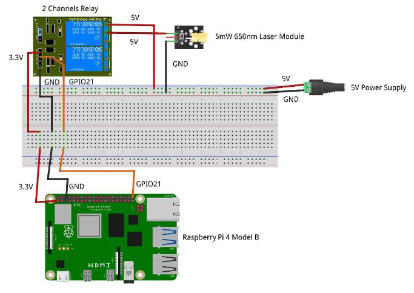
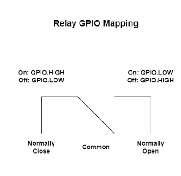

<h1 align="center">
  Backlog 1 Sprint 2
</h1>

<p align="center">
  <i align="center">Lasers, Relays & Beat Following </i>❇
</p>

## Overview
In this sprint of the first backlog, the tasks are to:
1. Configure a Laser Switching Module
2. A Slow Laser Sequence (<69bpm)
3. A Fast Laser Sequence (>69bpm)

Sample codes can be found in the 'Backlog 1 Sprint2' Folder

## Configuring a Laser Switching Module
In this project, we are using a Raspberry Pi 4. Below is a picture of the GPIO Pinouts.

<details><summary><b>Raspberry Pi 4 GPIO Pinouts</b></summary>
  <br>
</details>

With reference to the GPIO pinouts, we are able to begin the hardware connections. Before we begin, you need:
* 2x Laser Module
* 2 Channel Relay Module
* Raspberry Pi 4
Please connect these hardware in the manner as shown below.
<details><summary><b>Laser Modules Connection Schematic</b></summary>
  <br>
  <br><br>
  In reference to the images above, the Laser Connection Schematic currently has the relay on Normally Closed (NC), however, we will have to swap the connection from NC to Normally Open (NO).
</details>

We will be controlling the lasers via a UI as well which can be found in [Laser_Gui.py](./Laser_Gui.py) which has to include functions for turning the Laser On and Off, activating a faster laser sequence and a slow laser sequence.

## Creating a Slow/Fast Laser Sequence
Now that we are able to turn the laser On and Off, we can create an automated sequence for the laser to follow a set amount of beats.
1. Define Turning On and Off the Laser in the new file
   Turning <b>ON</b> the laser:
    ```
    def laser_on():
      GPIO.setmode(GPIO.BCM)
      GPIO.setup(21, GPIO.OUT)
    
      GPIO.output(21, GPIO.LOW)
      print('Relay ON - The relay will stay on until the program is terminated')
    ```
      
   Turning <b>OFF</b> the Laser:
   ```  
    def laser_off():
      GPIO.setmode(GPIO.BCM)
      GPIO.setup(21, GPIO.OUT)
    
      GPIO.output(21, GPIO.HIGH)  # Turn off the relay
      print('Relay OFF - Cleaning up GPIO.')
      GPIO.cleanup()
   ```
2. Counting the beats:
   This can be found in both files of [Fast_Violin.py](./Fast_Violin.py) and [Slow_Creep.py](./Slow_Creep.py) where you can can create a counter as shown below to follow a set bpm that can be called in [Laser_Gui.py](./Laser_Gui.py). In the counter when called, the values that can be set are the bpm you are intending to seek and the duration of how long you want the code to run for.
   ```
   def counter(bpm, duration):
      beat_gap = 60/bpm # Time interval between beats
      count = 0
      start_time = time.time()
      while time.time() - start_time < duration :
          time.sleep(beat_gap)
          count += 1
          if count % 2 == 0:
            laser_on()
          elif count == 2:
            laser_off()
          else:
            laser_on()
    print(f"Counted {count} beats in {duration} seconds.")
    laser_off()
    ```
    
      
</details>
