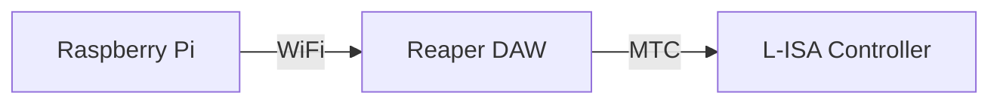

<h1 align="center">
  Backlog 2 Sprint 1
</h1>

  <i align="center">Reaper DAW & L-ISA Controller </i>🎧

## Overview
In this sprint of the second backlog, the tasks are to:
1. Raspberry Pi to Reaper DAW OSC Communication
2. Reaper DAW to L-ISA Controller via MIDI Timecode (MTC)

Sample codes can be found in the 'Backlog 2 Sprint1' Folder

## Hardware

## Raspberry Pi to Reaper DAW OSC Communication

<b>Configuring Reaper DAW</b>

  
1. Go to <b>Reaper Preferences</b> using the shortcut `Ctrl + P`
  
2. Navigate to **Control/OSC/Web** (Purple Box)
  
3. Click on `Add` to configure a new OSC device.

*Reaper Preference Windows*

4. Configure **new OSC Device** as shown in the picture below.

## Reaper DAW to L-ISA Controller via MIDI Timecode (MTC)
