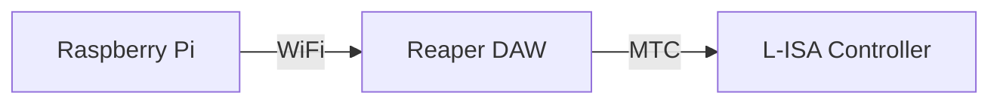
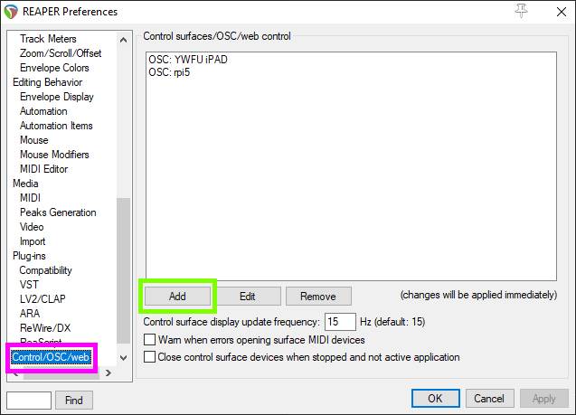
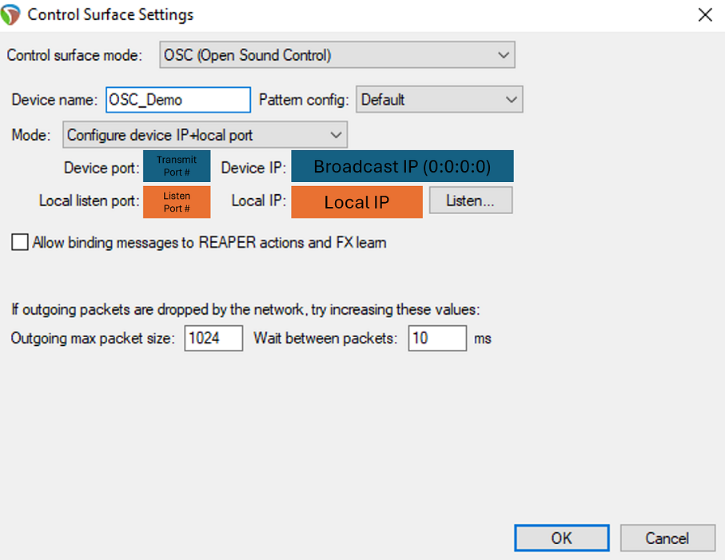
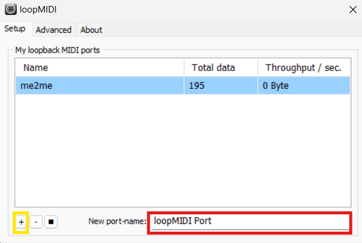
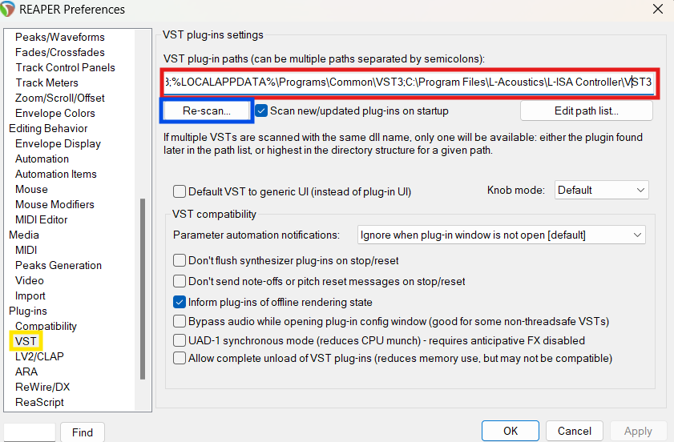
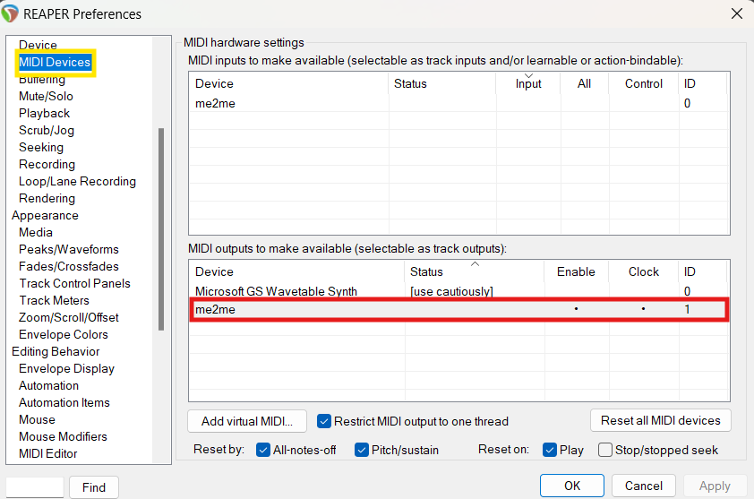
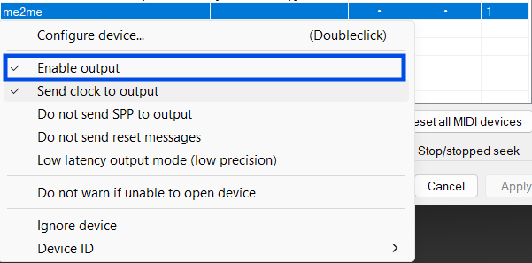
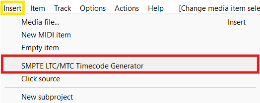

<h1 align="center">
  Backlog 2 Sprint 1
</h1>

<p align="center">
  <i align="center">Reaper DAW & L-ISA Controller </i>🎧
</p>

## Overview
In this sprint of the second backlog, the tasks are to:
1. Raspberry Pi to Reaper DAW OSC Communication
2. Reaper DAW to L-ISA Controller via MIDI Timecode (MTC)

Sample codes can be found in the 'Backlog 2 Sprint1' Folder

## Hardware


## Raspberry Pi to Reaper DAW OSC Communication
<details><summary><b>Configuring Reaper DAW</b></summary>
  
1. Go to <b>Reaper Preferences</b> using the shortcut `Ctrl + P`
  
2. Navigate to **Control/OSC/Web** (Purple Box)
  
3. Click on `Add` to configure a new OSC device.

   

    *Reaper Preference Windows*
  
    *Image taken from Huats-Club*

4. Configure **new OSC Device** as shown in the picture below.

   

   *Image taken from Huats-Club*
   
</details>

<details><summary><b>Configuring Raspberry Pi</b></summary>
  
  1. Create a directory folder for the [GUI](./Backlog%202%20Sprint1/Gui.py), [Markers](./Backlog%202%20Sprint1/markers.py) and [Play_stop](./Backlog%202%20Sprint1/play_stop.py) files. For example, we can name this folder *reaper*.

     ```
     mkdir reaper
     ```

  2. Please copy the files below into the folder directory `~/reaper`

     ```
     Gui.py
     markers.py
     play_stop.py
     ```

  3. Edit the IP address in the various files to that of the Laptop that is running reaper

     - Line 19 of `markers.py`
       
       ```
       PI_A_ADDR = "REAPER LAPTOP IP ADDR"
       ```
       
     - Line 19 of `play_stop.py`

       ```
       PI_A_ADDR = "REAPER LAPTOP IP ADDR"
       ```

  4. Run the GUI file, where it has called markers and play_stop functions from the markers.py and play_stop.py. If the files were installed properly and the OSC was configured correctly, the Play/Stop button will Play and Stop the track, and the marker buttons will send the playback to the various markers.

     ```
       python3 Gui.py
     ```
     
</details>

## Reaper DAW to L-ISA Controller via MIDI Timecode (MTC)
Before starting this part of the installation, please ensure that you have **loopMIDI** installed. If you do not, please install it at the link [here](https://www.tobias-erichsen.de/software/loopmidi.html).

<details><summary><b>Configuring loopMIDI</b></summary>
  
After installation of loopMIDI, create a new port by just:
1. Typing in any name you would like for your MIDI port (Red Box), in this case, the port name will be called me2me.
2. Press the '+' button (Yellow Box)
   
   

   *loopMIDI Setup Page*
   
</details>

<details><summary><b>Configuring Reaper DAW</b></summary>

1. Go to **Reaper Preferences** by pressing `Ctrl + P`
   
2. Navigate to **VST** (Yellow Box)

3. Enter the path to the folder where your L-ISA plugins are installed e.g: (Red Box)
```
c:\Program Files\L-Acoustics\L-ISA Controller\VST3\
```
4. Hit Rescan (Blue Box)

   

   *Reaper Config Menu*

5. Still in the Reaper Preferences, navigate to Audio (Yellow Box), then to Devices. (Red Box)

6. Select L-ISA Audio Bridge as an audio device. (Blue Box)

7. Select the Output Range that you want to use. (Black Box)

   

   *Reaper Config Menu - Audio Devices*

8. Still in Reaper Preferences under Audio, go to MIDI Devices (Yellow Box)

9. Select the loopMIDI Port in the MIDI Output List (Red Box)

10. If not enabled, right-click on it and select "Enable Output" (Blue Box)

    

    *Reaper Config Menu - MIDI Devices*

    

    *Reaper Enable Output - MIDI*

11. By pressing the **Insert** (Yellow Box) and **SMPTE LTC/MTC Timecode Generator** (Red Box), insert a Timecode Generator

    

    *Insert Timecode Generator*

12. Select the Timecode Generator Track and open it's source properties by pressing `Ctrl + F2`

13. If not done, click the **Send MIDI(MTC)** button to enable MIDI Timecode instead of LTC. (Blue Box)

14. Press Apply. (Black Box)

    

    *Change to MTC*

</details>

<details><summary><b>Setting Up L-ISA</b></summary>
</details>
