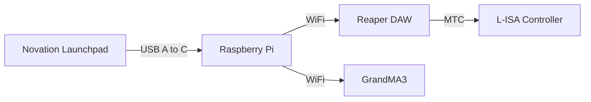

<h1 align="center">
  Backlog 2 Sprint 2
</h1>

  <i align="center">LaunchPad & Game Crafting </i>🕹️

## Overview
In this sprint of the second backlog, the tasks are to:
 - Configure LaunchPad
 - LaunchPad MIDI to Raspberry Pi
 - MIDI to Reaper DAW
 - Foundation for a Reaction Training Game
   
Sample codes can be found in the 'Backlog 2 Sprint2' Folder
 - [gui.py](gui.py) - A tkinter-based GUI with controls for L-ISA Controller and GrandMA3
 - [midi.py](midi.py) - The main file which defines the base logic of the game and integrates the other files together
 - [osc_client_Grandma3.py](osc_client_Grandma3.py) - Code to send messages from the GUI to the GrandMA3 via OSC
 - [osc_client_LISA.py](osc_client_LISA.py) - Code to send messages from the GUI to L-ISA Controller via OSC
 - [play_stop.py](play_stop.py) - Code that defines functions necessary to start and stop the game
 - [reaper_markers.py](reaper_markers.py) - Code that defines functions to control Reaper DAW, projectiles, deflecting, win and fail conditions for the game 

## Hardware 

## Configuring Launchpad
Required Hardware: [Novation Launchpad MKIII](https://novationmusic.com/products/launchpad-pro-mk3)

The launchpad is the controller in which the game is played. The controller is split into five buttons, corresponding to the cardinal directions - north (red), south (green), east (blue) and west (yellow). The button in the middle is to start the game. 

 1. To import the controller layout, download the [preset
    file](launchpad-preset.syx) and visit the [Novation components
    website](https://components.novationmusic.com/launchpad-pro-mk3/)
    
 2. Click New Custom Mode
 3. Upload Custom Mode
 4. Locate the launchpad-preset.syx file
 5. Connect your launchpad
 6. Send to Launchpad Pro MK3
 7. Select the custom mode of your choice
 8. On the launchpad, press the Custom button
 9. Press the respective button where you sent the custom mode to
 10. Done! You should see the button layout on the launchpad itself. 

## Launchpad MIDI to Raspberry Pi
## MIDI to Reaper DAW
## Foundation for a Reaction Training Game

