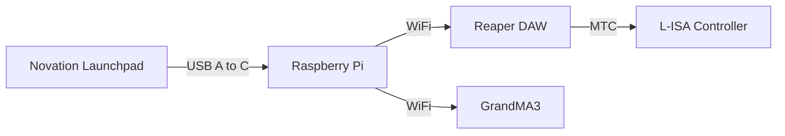
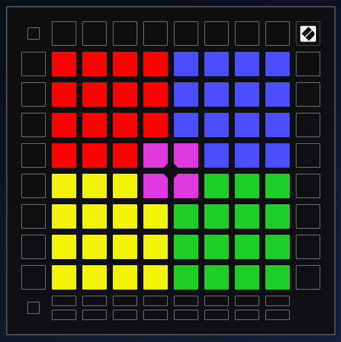
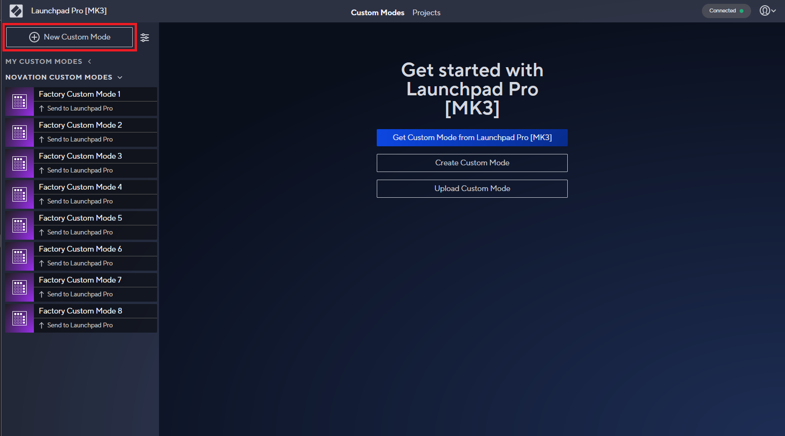
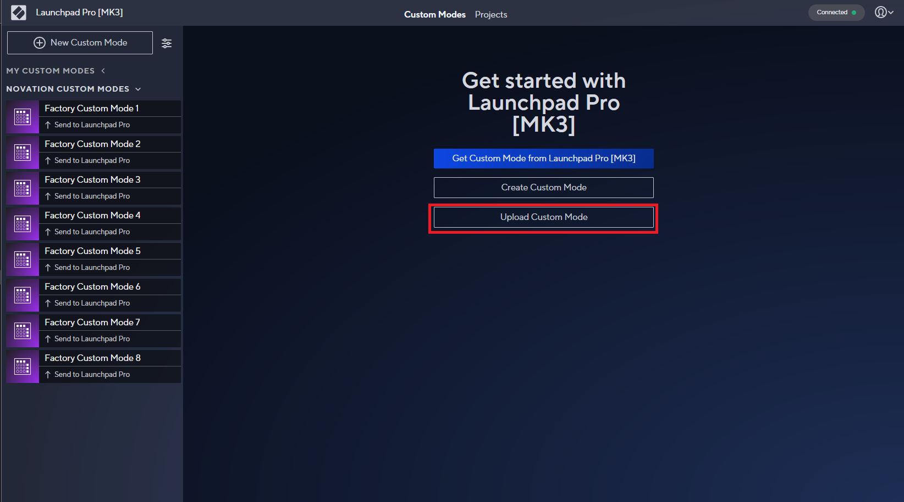
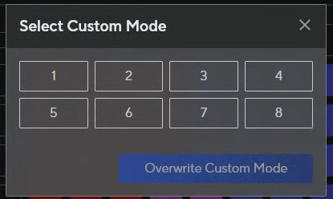
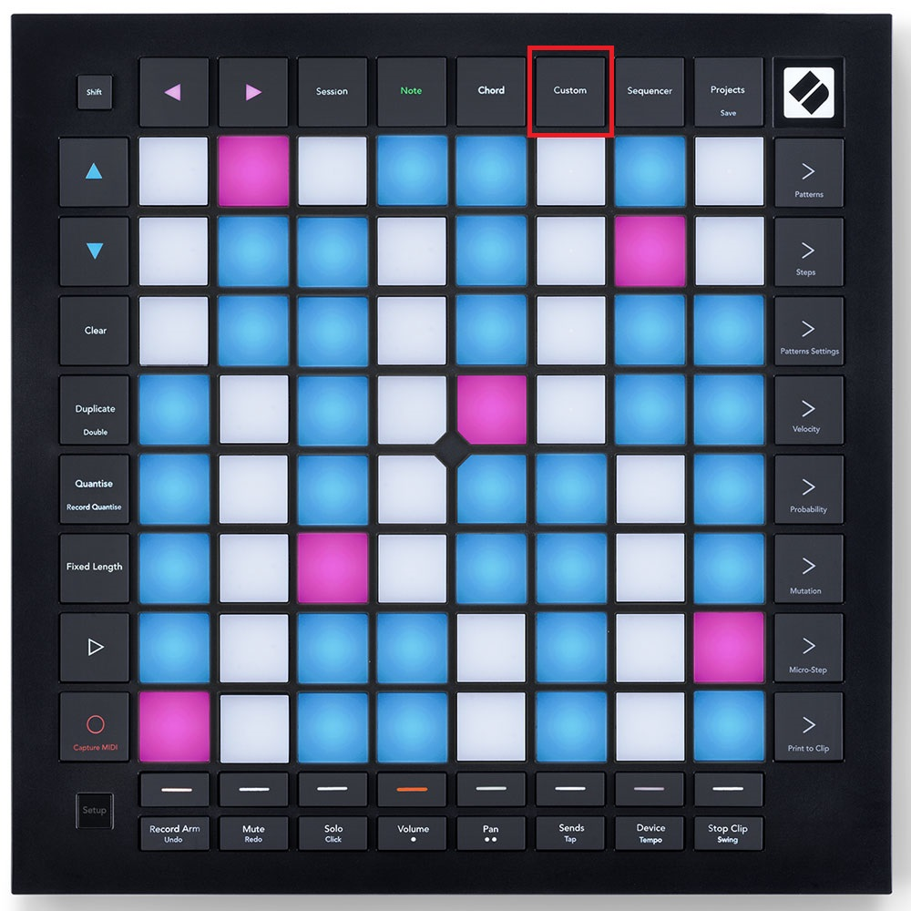

<h1 align="center">
  Backlog 2 Sprint 2
</h1>

  <i align="center">LaunchPad & Game Crafting </i>🕹️

## Overview
In this sprint of the second backlog, the tasks are to:
 - Configure LaunchPad
 - LaunchPad MIDI to Raspberry Pi
 - MIDI to Reaper DAW
 - Foundation for a Reaction Training Game
   
Sample codes can be found in the 'Backlog 2 Sprint2' Folder
 - [gui.py](gui.py) - A tkinter-based GUI with controls for L-ISA Controller and GrandMA3
 - [midi.py](midi.py) - Main file which defines the base logic of the game and integrates the other files together
 - [osc_client_Grandma3.py](osc_client_Grandma3.py) - Send messages from the GUI to the GrandMA3 via OSC
 - [osc_client_LISA.py](osc_client_LISA.py) - Send messages from the GUI to L-ISA Controller via OSC
 - [play_stop.py](play_stop.py) - Defines functions necessary to start and stop the game
 - [reaper_markers.py](reaper_markers.py) - Defines functions to control Reaper DAW, projectiles, deflecting, win and fail conditions for the game 

## Hardware Diagram

## Launchpad Configuration
Required Hardware: [Novation Launchpad MKIII](https://novationmusic.com/products/launchpad-pro-mk3)

The launchpad is the controller in which the game is played. The controller is split into five buttons, corresponding to the cardinal directions - north (red), south (green), east (blue) and west (yellow). The button in the middle is to start the game. 

<b>Show Instructions to Configure LaunchPad</b>

To import the controller layout, download the [preset file](launchpad-preset.syx) and visit the [Novation components website](https://components.novationmusic.com/launchpad-pro-mk3/)
    
1. Click New Custom Mode

    

2. Upload Custom Mode

    

3. Locate the launchpad-preset.syx file
4. Connect launchpad to your device
5. Send to Launchpad Pro MK3

    

6. Select the custom mode of your choice

    

7. Once the preset has been uploaded, press the Custom button on the launchpad

    

8. Press the respective button where you sent the custom mode to

    

9. Done! The launchpad should now show the preset layout.

## Launchpad MIDI to Raspberry Pi

## MIDI to Reaper DAW
## Foundation for a Reaction Training Game

