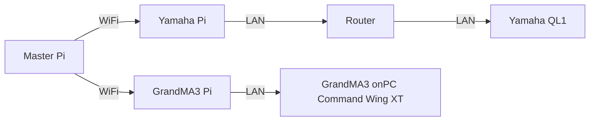

<h1 align="center">
  Backlog 1 Sprint 1
</h1>

<p align="center">
  <i align="center">Open Sound Control and GUI Making </i>⚙️
</p>


## Overview
In this sprint of the first backlog, the tasks are to:
1. Install OSC on Raspberry Pi
2. Create a UI via tkinter
3. Raspberry Pi to Raspberry Pi OSC Communication
4. OSC Communication to Yamaha QL1, GrandMA3

Sample codes can be found in the 'Backlog1 Sprint1' Folder

## Hardware Setup


## Installing OSC on Raspberry Pi

<details><summary><b>Show Instructions</b></summary>
  
1. Install Python-OSC on **Raspberry Pi**:

    ```sh
    pip3 install python-osc==1.8.1
    ```

</details>

## Creating a UI via tkinter

For this exercise, please refer to the [gui.py](./Master%20pi/gui.py) file here.
In this file, the UI is used to send OSC commands to 2 seperate Raspberry Pis which are meant to send commands to the varying devices they are connected to which in this case are:
- Yamaha QL1 (Faders 1-3, Up and Down Volume Control)
- GrandMA3 (Sequence 1 & 2, Pause and Oops command)

## Raspberry Pi to Raspberry Pi OSC Communication

## OSC Communication to Yamaha QL1, GrandMA3
In this section, this is a guide on controlling the Yamaha QL1 and GrandMA3 via OSC.
<details><summary><b>Show Instructions for Yamaha QL1</b></summary>
  
1.  Assuming that your virtual environment has been set up, download master pi folder and place it in your virtual environment folder
2.  Configure your IP address and Port Number:
    ```
    PI_A_ADDR = "192.168.254.72"		#Should be your GrandMA3 IP address
    PORT = 23                       #Port Address of the GrandMA3
    addr = "/print"
    ```
3. To start the program, just need to type:

    ```
    sudo ~/<venv_name>/bin/python gui.py
    ```

</details>

<details><summary><b>Show Instructions for GrandMA3</summary>

1.  Similarly with the Instructions for Yamaha QL1, however just make sure your IP address and Port Number from GrandMA3 is correct:
    ```
    PI_A_ADDR = "192.168.254.72"		#Should be your GrandMA3 IP address
    PORT = 23                       #Port Address of the GrandMA3
    addr = "/print"
    ```


</details>
