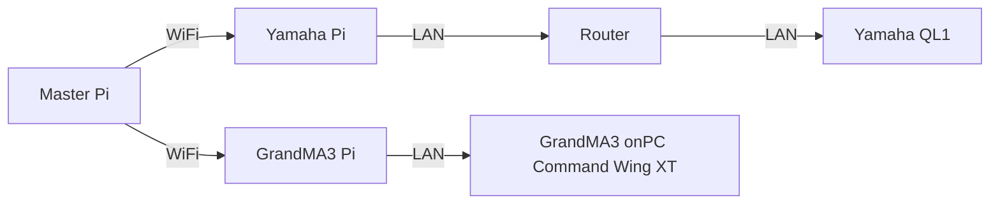

<h1 align="center">
  Backlog 1 Sprint 1
</h1>

<p align="center">
  <i align="center">Open Sound Control and GUI Making </i>⚙️
</p>


## Overview
In this sprint of the first backlog, the tasks are to:
1. Install OSC on Raspberry Pi
2. Create a UI via tkinter
3. Raspberry Pi to Raspberry Pi OSC Communication
4. OSC Communication to Yamaha QL1, GrandMA3

## What do you need?
Inside the Master Pi is what you need, gui.py, osc_client_Grandma3.py and osc_client_Yamaha.py.

Sample codes can be found in the 'Backlog1 Sprint1' Folder.

Related Links: 
[Raspi-GrandMA3](https://github.com/huats-club/oscstarterkit/tree/main/tutorial5) and
[Raspi-Yamaha QL/CL](https://github.com/huats-club/oscstarterkit/tree/main/tutorial4)

## Hardware Setup


## Installing OSC on Raspberry Pi

<details><summary><b>Show Instructions</b></summary>
  
1. Install Python-OSC on **Raspberry Pi**:

    ```sh
    pip3 install python-osc==1.8.1
    ```

</details>

## Creating a UI via tkinter

For this exercise, please refer to the [gui.py](./Master%20pi/gui.py) file here.
In this file, the UI is used to send OSC commands to 2 seperate Raspberry Pis which are meant to send commands to the varying devices they are connected to which in this case are:
- Yamaha QL1 (Faders 1-3, Up and Down Volume Control)
- GrandMA3 (Sequence 1 & 2, Pause and Oops command)

## Raspberry Pi to Raspberry Pi OSC Communication
In order to achieve this, you can refer to the [osc_client_Grandma3.py](./Master%20pi/osc_client_Grandma3.py) for the Master Pi to the GrandMA3 and the [osc_client_Yamaha.py](./Master%20pi/osc_client_Yamaha.py) for the Master Pi to the Yamaha QL Pi.

<details><summary><b>Show Instructions for GrandMA3</b></summary>
  
Refer to the [osc_client_Grandma3.py](./Master%20pi/osc_client_Grandma3.py) where on Line 18 and 19, you will have to configure the `PI_A_ADDR` and the `PORT` to match that of your GrandMA3 Pi

```
PI_A_ADDR = "192.168.254.137"		# ip of GrandMA3 ras pi (When swapping network please check)
PORT = 23
addr = "/print"
```

After which, you will need to insert the [GrandMa3TestingComm.py](./Grandma3%20pi/GrandMa3TestingComm.py) and change the IP addresses respectively at Line 5 and 6 where the `receiver_ip` and the `receiver_port` should be that of the GrandMA pi.

```
receiver_ip = "192.168.254.72"
receiver_port = 23
```

Alongside that, you will need to change the OSC Client address to that of the GrandMA3 on line 9 to 11 where you need to change `Yamaha` and `Port` to the respective IP address and Port of the GrandMA console.

```
Yamaha = "192.168.254.142"  # IP of the laptop running the GrandMA3Commands.py script
Port = 8000
osc_address = ""
```
</details>

<details><summary><b>Show Instructions for Yamaha QL1</b></summary>

Refer to the [osc_client_Yamaha.py](./Master%20pi/osc_client_Yamaha.py) where Line 19 and 20 you will have to configure the `PI_A_ADDR` and the `port` to the respective IP address and port number as the Yamaha Pi.

```
PI_A_ADDR = "192.168.254.72"		# ip of GrandMA3 ras pi (When swapping network please check)
PORT = 23
addr = "/print"
```

Following that, you will have to go to [osc_server.py](./Yamaha%20pi/osc_server.py) where in Lines 6 and 7, you will have to change the `receiver_ip` and `port` to the respective IP address and port number as the Yamaha Pi

```
receiver_ip = "192.168.254.72"
receiver_port = 23
```

After doing this, you will also have to navigate to [command.py](./Yamaha%20pi/command.py) where in lines 11 and 13, you must configure the `host` and `port`. Ensure that for the `port` it is always at `49280`

```
# Host is console's IP
host ="192.168.1.128"
# Port must be 49280
port =49280
```
</details>

## OSC Communication to Yamaha QL1, GrandMA3
In this section, this is a guide on controlling the Yamaha QL1 and GrandMA3 via OSC.
<details><summary><b>Show Instructions for Yamaha QL1</b></summary>
  
1.  Assuming that your virtual environment has been set up, download master pi folder and place it in your virtual environment folder
2. If you wish to change the values of the Yamaha faders:

    ```
    def yamahafader1Up():
  	rangeconvert1()
  	global PI_A_ADDR
  	global PORT
  	global addr
  	msg = "set MIXER:Current/InCh/Fader/Level 0 0 {NewValue1} "	      # Configure this 
  	print(NewValue1)                                                  # Print value for feedback
  	send_message(PI_A_ADDR, PORT, addr, msg)                          # To send commands to the Yamaha QL
    ```

</details>

<details><summary><b>Show Instructions for GrandMA3</b></summary>

1.  If you wish for the buttons to change commands, please edit:
    ```
    def sequence1_osc():
  	global PI_A_ADDR
  	global PORT
  	global addr
  	#msg = "OSC Sequence 1 from pi"
  	msg = "Go+ Exec 201 Executor 202 At 0 "    # Change the msg by using GrandMA3
  	send_message(PI_A_ADDR, PORT, addr, msg)   # To send commands to GrandMA3
    ```

</details>


<details><summary><b>To Start</b></summary>
1.  Enter virtual environment:
  
```
source <environment_folder>/bin/activate
```
2. Change Directory:

```
cd {folder where environment was created, eg cd john}
```
   
3.To start the program:
      
   ```
   sudo ~/<venv_name>/bin/python gui.py
   ```

      
</details>
