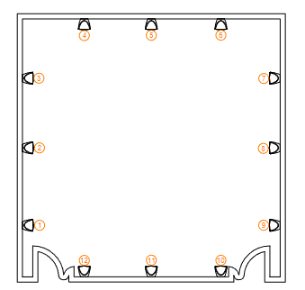

<h1 align="center">
  Backlog 3 Sprint 1
</h1>

<p align="center">
  <i align="center">More, More & More Lasers! </i>❇
</p>

## Overview
In this sprint of the third backlog, the tasks are to:
1. Slave Pi Preparation
2. Cable Fabrication

Sample codes can be found in the 'Backlog 3 Sprint1' Folder

* [Laser_Gui.py](./Laser_Gui.py) - A GUI to control the Laser Modules, including Turning On/Off **with the server**.
* [osclaser_server_V2.py](./osclaser_server_V2.py) - A server to be ran on the **Master Raspberry Pi** to send a command to the Slave Raspberry Pis.
* [osclaser_trigger_V2.py](./osclaser_trigger_V2.py) - A server to be ran on the **Slave Raspberry Pis** to receive commands from  the Master Raspberry Pi

## Hardware Setup
In this project, we are placing 2 lasers on each of the 12 speakers in the classroom, pointed at a mirror on the diaphragm to produce patterns and shapes from the vibration produced from the music played. <br>

On the middle speaker of each side, there will be a Raspberry Pi 4 as a **Slave Raspberry Pi** to receive commands from the Master Raspberry Pi in order to trigger OSC commands of GPIO.HIGH or GPIO.LOW to various relay channels which would turn the respective lasers on or off. <br>

In case reference is needed, you can refer to the Raspberry Pi 4's GPIO pinouts as shown below:
<details><summary><b>Raspberry Pi 4 GPIO Pinouts</b></summary>
  <br>
</details>

With reference to the GPIO pinouts, we are able to begin the hardware connections. Before we begin, you need:
* 6x Laser Module
* 3x 2 Channel Relay Module
* Raspberry Pi 4
* Breadboard
Please connect these hardware in the manner as shown below.
<details><summary><b>Laser Modules Connection Schematic</b></summary>
  <br>
</details>

We will be controlling the lasers via a UI as well which can be found in [Laser_Gui.py](./Laser_Gui.py) which has to include functions for turning the Laser On and Off, **with the server Pi running**. 

As such, the speaker layout of the room can be seen below here:



## Code Breakdown
<details><summary><b>Laser_Gui.py</b></summary>
  
In this code, there is a OSC client to send out OSC messages to the Master Pi holding the <a href="osclaser_server_V2.py">osclaser_server_V2.py</a> code. You will need to ensure that the `send_addr` and `send_port` are set to that of the Master Pi. Alongside that, the addr is preset to `"/print"` In this example, this was set on lines 77, 78 and 79 as:
  
```
send_addr = "192.168.254.49"
send_port = "2000"
addr = "/print"
```

Following that, in the various functions in this code, the message is set for example from the function `laser1_on` this is seen as:
```
msg = ["7,1,1"]
send_msg(send_addr, send_port, addr, msg)
```
The message works in the way that the first part of the message is which speaker number, in this case it is speaker 7. 

Following that is which relay channel. In this event it is 1. 

Lastly, it is the status of the laser being On or Off. In this event, since the number is 1, the laser will be On.
</details>

<details><summary><b>osclaser_server_V2.py</b></summary>
  
In this code, there is both an OSC client and server. One to receive OSC messages from the GUI and the other to send out the messages to the Slave Pis which hold the <a href="osclaser_trigger_V2.py">osclaser_trigger_V2.py</a> code. Thus we need to ensure that the `receiver_ip` and `port` which in this example is listed on lines 10 and 11 as:
```
receiver_ip = "192.168.254.49"
receiver_port = "2003"
```
Following that, there is `print_args(addr, *args)` function which will take the message received and send them out again based on which speaker it was from. The code looks as such:
```
def print_args(addr, *args):
  if addr == "/print":
    print(f"message received {args[0]}")
    msg = args[0]
    var = args[0].split(',')
    spk = int(var[0].strip())
    addr = "/trigger"

    if 1 <= spk <= 3:
       send_addr = "192.168.254.197" #Team C
       send_port = 2001
    elif 4 <= spk <= 6:
      send_addr = "192.168.254.101" #Team E
      send_port = 2002
    elif 7 <= spk <= 9:
      send_addr = "192.168.254.72" #Team B
      send_port = 2003
    elif 10 <= spk <= 12:
      send_addr = "192.168.254.236" #Team F
      send_port = 2004
    
    osc_client.send_message(send_addr, send_port, addr, msg)
```
This shows that if the code receives a message with the address `/print`, it will receive the message and reset the variables according to the message received. In this code, it splits the message sent into the variables that determine which speaker it is coming from. 

In this case, there are different `send_addr` and `send_port` based on which speaker number was received from the message.
</details>

<details><summary><b>osclaser_trigger_V2.py</b></summary>

In this code, there is an OSC server and imported GPIO to receive messages from the Master Pi that holds the code <a href="osclaser_server_V2.py">osclaser_server_V2.py</a> and to be able to activate the GPIO pins to determine the lasers turning ON or OFF.

The `receiver_ip` and `receiver_port` has to be set accordingly. In this example, we will be using my Team (Team B)'s IP address and port. This is seen on lines 26 and 27 which show:
```
receiver_ip = "192.168.254.72"
receiver_port = 2003
```
Following that, the function `control_relay` will seperate the message again based on the speaker, relay channel and status if it receives a message with the addr `/trigger` which was already set in <a href="osclaser_server_V2.py">osclaser_server_V2.py</a> and from there as an example from lines 38 to 84 which is shown below in:
```
        if spk == 7: # Change according to spk number (refer to S536 drawing)
            if channel == 1:
                if value == 1:
                    GPIO.output(r1_c1, GPIO.LOW)
                    print("Relay 1 channel 1 turned ON")
                elif value == 0:
                    GPIO.output(r1_c1, GPIO.HIGH)
                    print("Relay 1 channel 1 turned OFF")
            elif channel == 2:
                if value == 1:
                    GPIO.output(r1_c2, GPIO.LOW)
                    print("Relay 1 channel 2 turned ON")
                elif value == 0:
                    GPIO.output(r1_c2, GPIO.HIGH)
                    print("Relay 1 channel 2 turned OFF")

        elif spk == 8: # Change according to spk number (refer to S536 drawing)
            if channel == 1:
                if value == 1:
                    GPIO.output(r2_c1, GPIO.LOW)
                    print("Relay 2 channel 1 turned ON")
                elif value == 0:
                    GPIO.output(r2_c1, GPIO.HIGH)
                    print("Relay 2 channel 1 turned OFF")
            elif channel == 2:
                if value == 1:
                    GPIO.output(r2_c2, GPIO.LOW)
                    print("Relay 2 channel 2 turned ON")
                elif value == 0:
                    GPIO.output(r2_c2, GPIO.HIGH)
                    print("Relay 2 channel 2 turned OFF")

        elif spk == 9: # Change according to spk number (refer to S536 drawing)
            if channel == 1:
                if value == 1:
                    GPIO.output(r3_c1, GPIO.LOW)
                    print("Relay 3 channel 1 turned ON")
                elif value == 0:
                    GPIO.output(r3_c1, GPIO.HIGH)
                    print("Relay 3 channel 1 turned OFF")
            elif channel == 2:
                if value == 1:
                    GPIO.output(r3_c2, GPIO.LOW)
                    print("Relay 3 channel 2 turned ON")
                elif value == 0:
                    GPIO.output(r3_c2, GPIO.HIGH)
                    print("Relay 3 channel 2 turned OFF")
```

</details>
So according to the spk number, it will change which GPIO pin will be triggered, after that whether the GPIO would go HIGH or LOW based on the status.
