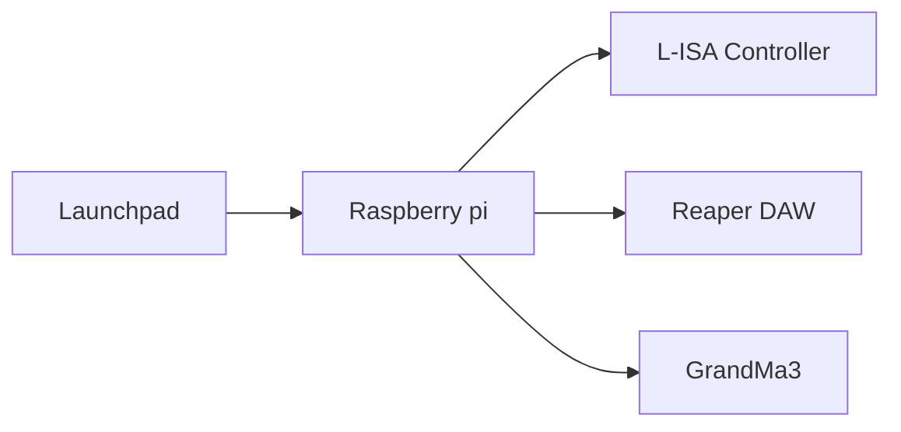

<h1 align="center">
  Backlog 3 Sprint 2
</h1>

<p align="center">
  <i align="center">Game, Game & More Game! </i>🎮
</p>

## Overview
In this sprint of the third backlog, the tasks are to:
1. Full Length Game
   
Sample codes can be found in the 'Backlog 3 Sprint2' Folder

* [gui.py](./gui.py) - A GUI containing controls for Reaper DAW (E.g. Jumping to markers, play/stop), L-Isa controller (E.G. Snapshots ), and GrandMa3(E.g. Sequences for win/lose)

* [Lisa_GrandMa3_Functions.py](./Lisa_GrandMa3_Functions.py) - Contains functions to send messages to L-Isa and GrandMa3 to start sequences or jump to snapshots

* [reaper_markers.py](./reaper_markers.py) - Similarly to [Lisa_GrandMa3_Functions.py](./Lisa_GrandMa3_Functions.py) but for jumping markers in Reaper DAW

* [Gamestart_wipV2.py](./Gamestart_wipV2.py) - Back up of old, functional version of game ccode

* [gamecodeV50.py](./gamecodeV50.py) - Most recent, non-functional version of game code

* [Gamestart_wipV2_1.py](./Gamestart_wipV2_1.py) - Transitional back-up between old([Gamestart_wipV2.py](./Gamestart_wipV2.py)) and current [gamecodeV50.py](./gamecodeV50.py)

* [definitions.py](./definitions.py) - Functions for game codes, used in [Gamestart_wipV2.py](./Gamestart_wipV2.py) and [Gamestart_wipV2_1.py](./Gamestart_wipV2_1.py)

## Hardware


## Game Code
<details><summary><b>Creating functions for input/output arguments</b></summary>

</details>

<details><summary><b>Return to projectile after deflect</b></summary>

In [gamecodeV50.py](./gamecodeV50.py), this is achieved in lines 156 to 165, in the function
stg1prokectilesRandom
```
def stg1projectilesRandom():
    if random.randint(1,3) == 1:
        reaper_markers.stg1projectile2()
        print("Stage 1 Projectile 2 is firing")
    elif random.randint(1,3) == 2:
        reaper_markers.stg1projectile3()
        print("Stage 1 Projectile 3 is firing")
    else:
        reaper_markers.stg1projectile4()
        print("Stage 1 Projectile 4 is firing")
```

This funcion achieves the needed requirements by assigning each projectile marker to a number, and using `random.randint` with the range of the number of projectiles to randomly decide which projectile is jumped to.

With the random.randint, this allows for soft coding with future stages of the game.
</details>

