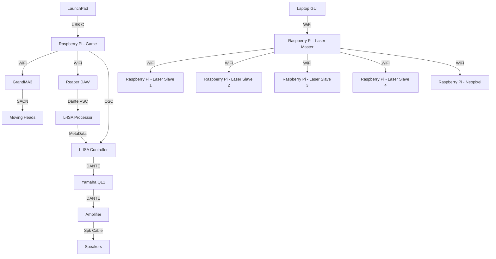
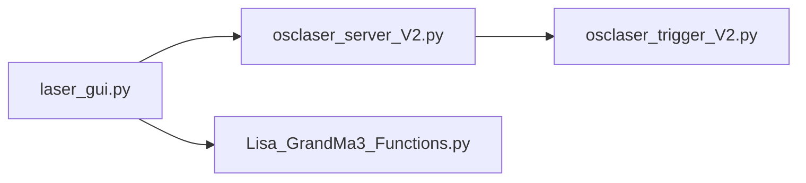
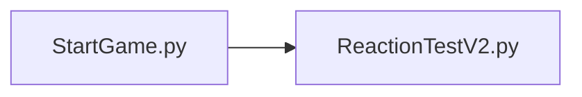

<h1 align="center">
  Final Demonstration
</h1>

<p align="center">
  <i align="center">Our final demonstration before the showcase </i>👍
</p>

## Overview
This repository contains all the notable assets, codes and others for our Final Demonstration in Week 17 that covers Station 4 - Reaction Training.

In the Final Demonstration, we will be using a Master Station, shared with the other teams. In which in the venue, there are 12 Speakers and the participant will be standing in the middle of the room to play their game.

For the Final Demonstration, the demonstration will feature a full run through of the game. Including 3 stages, a start, a restart and a pass and fail. 

## Hardware & Software Setup


To setup the hardware and software connections, please read through the following:
1. **[Backlog 1 Sprint 1](NYP-EGL314-MSP1/Backlog1%20Sprint1/B1S1.md)** - Base foundation on controlling the GrandMA3
2. **[Backlog 2 Sprint 1](NYP-EGL314-MSP1/Backlog%202%20Sprint1/B2S1.md)** - Configuring L-ISA Studio and Reaper DAW for OSC and MTC control
3. **[Backlog 2 Sprint 2](NYP-EGL314-MSP1/Backlog%202%20Sprint2/B2S2.md)** - Configuring a LaunchPad, sending MIDI commands to Reaper DAW, L-ISA Controller and GrandMA3
4. **[Backlog 3 Sprint 1](NYP-EGL314-MSP1/Backlog3%20Sprint1/B3S1.md)** - Triggering Lasers from a GUI to multiple Raspberry Pis via a Master Pi.

For the Final Demonstration, we will be using a new game code as the game in the past documentations were incomplete. Though despite this, majority of the hierarchy remains the same.

## Assets
Here, are all the varying assets used for the POC. This includes:
1. **[Digital Posters](./Assets/Poster)** - Includes an updated PNG version of the Digital Poster

   
   
2. **[Audio Assets](./Assets/Audio%20Assets)** - Includes a Master Reaper File, a Master L-ISA Controller File and the varying audio assets.
3. **[GrandMA3](./Assets/GrandMA3/FinalTry.show)** - Includes a Master GrandMA3 file (With lights and IP addresses patched.)

In the final demonstration, there are a few updates to the various files.
1. **Reaper** <br>
   In the Reaper File, there are new audio assets for the various teams and their laser shows. In this case, it would be for Team B.
   
2. **GrandMA3** <br>
   In this GrandMA3 file, there are 2 new sequences. One for the Laser Show for Team B and the other for Face Lights, to ensure that the industry guests are able to see the various team members faces.

## Code Files
In this folder, there are multiple python files. We will take a dive into the details of the codes.

Below, there are more detailed explanations of the codes in their respective uses.
<details><summary><h2>Laser Show</h2></summary>

In the laser show, it mainly revolves around [laser_gui.py](./Laser_Gui.py), [osclaser_server_V2.py](./osclaser_server_V2.py) and [osclaser_trigger_V2.py](./osclaser_trigger_V2.py) with the addition of the importing of the [Lisa_GrandMa3_Functions.py](./Lisa_GrandMa3_Functions.py) due to the change in the flow of the Laser Show.

For the laser show, this is how the code hierarchy would look like:

<details><summary><h3>Laser_Gui.py</h3></summary>
  
In [Laser_Gui.py](./Laser_Gui.py), there are a few things to note. Firstly, are the imports. Importing in the pythonosc library to be able to communicate with the Master Raspberry Pi and the Slave Raspberry Pi after. Also importing the [reaper_markers.py](./reaper_markers.py) code. These are all seen from lines 1 to 7.
  
```
from pythonosc import osc_server, dispatcher

from pythonosc import udp_client

import tkinter as tk

import reaper_markers

import Lisa_GrandMa3_Functions  # new

# import RPi.GPIO as GPIO

import time
```
With that, there is a need to set a send_addr, send_port and addr to be able to send a message to the Master Raspberry Pi, this can be seen from lines 131 to 133 where in this example, the send_addr is listed as `192.168.254.49`, then send_port listed as `2000` and the addr listed as `/print` which are the respective IP address and port of the Master Raspberry Pi
```
send_addr = "192.168.254.49"
send_port = 2000
addr = "/print"
```

Slightly late down in the code, there are 2 other different IP address and port used to send commands to 2 different Neopixel LED Strips as well. The 2 Neopixel LED Strips were placed on a truss and inside a balloon with the respective IP addresses of `192.168.254.242` and `192.168.254.102` along with the respective ports of `2005` and `2006`. Along with this, are codes for basic control of both Neopixels.
```
# Truss Neopixel
def send_color_array(colors):
    address = "/color_array"
    flattened_colors = [color for rgb in colors for color in rgb]
    client_Truss_Pixel.send_message(address, flattened_colors)
    print(f"Sent color array: {flattened_colors}")

def send_brightness(brightness):
    client_Truss_Pixel.send_message("/brightness", brightness)
    print(f"Sent brightness {brightness}")

def send_off():
    client_Truss_Pixel.send_message("/off", [])
    print("Sent off message")

PI_Balloon_Pixel = "192.168.254.102"
PORT_Balloon_Pixel = 2006
client_Balloon_Pixel = udp_client.SimpleUDPClient(PI_Balloon_Pixel, PORT_Balloon_Pixel)

# Ballon Neopixel
def send_color_array2(colors):
    address = "/color_array"
    flattened_colors = [color for rgb in colors for color in rgb]
    client_Balloon_Pixel.send_message(address, flattened_colors)
    print(f"Sent color array: {flattened_colors}")

def send_brightness2(brightness):
    client_Balloon_Pixel.send_message("/brightness", brightness)
    print(f"Sent brightness {brightness}")

def send_off2():
    client_Balloon_Pixel.send_message("/off", [])
    print("Sent off message")
```

After this, are the functions for the lasers. In here, we will take the few functions that have been included after the changes to the sequence for the laser show.
```
# Laser Functions

def crossfire():
    msg = ["2,1,1", "2,2,1",
           "5,1,1", "5,2,1",
           "8,1,1", "8,2,1",
           "11,1,1", "11,2,1"]

    y = int(0)
    while y < len(msg):
        send_message(send_addr, send_port, addr, msg[y])
        print(msg[y])
        y += 1

        if y == len(msg):
            break
    
def crossfireOff():
    msg = ["2,1,0", "2,2,0",
           "5,1,0", "5,2,0",
           "8,1,0", "8,2,0",
           "11,1,0", "11,2,0"]
    
    y = int(0)
    while y < len(msg):
        send_message(send_addr, send_port, addr, msg[y])
        print(msg[y])
        y += 1

        if y == len(msg):
            break

def crossfireOneByOne():
    msg = ["2,1,1", "2,2,1",
           "5,1,1", "5,2,1",
           "8,1,1", "8,2,1",
           "11,1,1", "11,2,1"]
    
    y = int(0)
    while y < len(msg):
        send_message(send_addr, send_port, addr, msg[y])
        print(msg[y])
        y += 1
        time.sleep(0.03)

        if y == len(msg):
            break

def crossfireOffOneByOne():
    msg = ["2,1,0", "2,2,0",
           "5,1,0", "5,2,0",
           "8,1,0", "8,2,0",
           "11,1,0", "11,2,0"]
    
    y = int(0)
    while y < len(msg):
        send_message(send_addr, send_port, addr, msg[y])
        print(msg[y])
        y += 1
        time.sleep(0.03)

        if y == len(msg):
            break

```
There are also more "advanced" NeoPixel functions that were created to suit the laser show, which all can be seen below
```
def NeoRise():
    send_off()
    send_off2()
    colors = [(0,0,0)] * 170
    delay = 29/170
 
    for i in range(170):
        colors[i] = (255,165,0)
        send_color_array(colors)
        time.sleep(delay)

def NeoBalloon():
    send_off2()
    balloon_colors = [(255,165,0)]
    send_color_array2(balloon_colors * 170)

def NeoStrobe():
    strobe_colors =  [(255,165,0)]
    strobe_duration = 1
    strobe_delay = 0.03

    end_time = time.time() + strobe_duration
    while time.time() < end_time:
        for color in strobe_colors:
            send_color_array2([color] * 170)
            send_color_array([color]* 170)

            time.sleep(strobe_delay)
            send_off()
            send_off2()

            time.sleep(strobe_delay)
    
    send_off()
    send_off2()

def NeoStrobeBlue():
    strobe_colors =  [(0,0,255)]
    strobe_duration = 10
    strobe_delay = 0.3

    end_time = time.time() + strobe_duration
    while time.time() < end_time:
        for color in strobe_colors:
            send_color_array2([color] * 170)
            send_color_array([color]* 170)

            time.sleep(strobe_delay)
            send_off()
            send_off2()

            time.sleep(strobe_delay)
    
    send_off()
    send_off2()

def NeoBalloonAndTrussBlue():
    send_off()
    send_off2()
    balloon_colors = [(0,0,255)]
    send_color_array(balloon_colors * 170)
    send_color_array2(balloon_colors * 170)

def NeoBallonAndTrussOrange():
    send_off()
    send_off2()
    balloon_colors = [(255,169,0)]
    send_color_array(balloon_colors * 170)
    send_color_array2(balloon_colors * 170)
```
Functions like these are then integrated into one big function for the laser show which can be seen here, along with explanations of what different lines do.
```
def lasersequence():
    try:
        Laser_SequenceRP()  # To run the command to jump to the Laser Show marker and playback the audio.
        GrandMA3_Sequence() # To run the command to go to the next cue of the sequence.
    except Exception as e:
        print(f"Error in Laser_SequenceRP: {e}")
        return

    print("test")

    beat_gap = 60 / 101  # Time interval between beats
    count = 0
    start_time = time.time()

    # Using a dictionary to map counts to functions
    actions = {
        0: [NeoRise],
        1: [GrandMA3_Sequence, NeoBalloon],
        7: [crossfire],
        10: [crossfireOff,NeoStrobeBlue],
        11: [NeoBalloonAndTrussBlue],
        12:[GrandMA3_Sequence],
        23:[NeoBallonAndTrussOrange],
        24:[crossfireOneByOne],
        31:[GrandMA3_Sequence]
        }

    try:
        while time.time() - start_time < 60:
            time.sleep(beat_gap)
            if count in actions:
                for action in actions[count]:
                    try:
                        action()
                    except Exception as e:
                        print(f"Error executing action for count {count}: {e}")

            print(count)
            count += 1

    except Exception as e:
        print(f"Error in main loop: {e}")

    try:
        reaper_markers.play_stop()
        print(f"Counted {count} beats in 60 seconds.")  # max Count = 73/72
    except Exception as e:
        print(f"Error during cleanup: {e}")
```

</details>

<details><summary><h3>osclaser_server_V2.py</h3></summary>

In osclaser_server_V2.py, it is a code to be put into the Master Raspberry Pi to carry out 2 functions. One, receiving the commands from the Laser_Gui. Two, to send the received commands to the Slave Raspberry Pi which holds [osclaser_trigger_V2.py](./osclaser_trigger_V2.py). First, the receiver_ip and receiver_port is to be set to the respective values of the Master Raspberry Pi which in this example is `192.168.254.49` and `2003`. This was set on lines 10 and 11 of the code as seen below:
```
receiver_ip = "192.168.254.49" # Team A
receiver_port = 2003
```
Following this, is the function to enable the Master Raspberry Pi to receive the commands and re-send them out to the Slave Raspberry Pi. There will be explanation next to the respective codes to talk about their functions seen from lines 13 to 35.
```
# this function prints the arguments in received OSC messages
def print_args(addr, *args):
  if addr == "/print": # An If statement to detect for the messages with the address /print
    print(f"message received {args[0]}")
    msg = args[0] 
    var = args[0].split(',')
    spk = int(var[0].strip()) 
    addr = "/trigger" # Sets a new address before sending out the message to slave raspberry pi

    if 1 <= spk <= 3:
       send_addr = "192.168.254.197" #Team C (Updates the send_addr and send_port to the respective Slave Raspberry Pis)
       send_port = 2001
    elif 4 <= spk <= 6:
      send_addr = "192.168.254.101" #Team E
      send_port = 2002
    elif 7 <= spk <= 9:
      send_addr = "192.168.254.72" #Team B
      send_port = 2003
    elif 10 <= spk <= 12:
      send_addr = "192.168.254.236" #Team F
      send_port = 2004
    
    osc_client.send_message(send_addr, send_port, addr, msg)
```
</details>

<details><summary><h3>osclaser_trigger_V2.py</h3></summary>

In osclaser_trigger_V2.py, it is a code to be put into the Slave Raspberry Pis, this code will receive the commands from the Master Raspberry Pi and followed by using RPi.GPIO to trigger the different relay channels that will then turn on and off the lasers respectively. Since there is going to be a use of the RPi.GPIO pins, there will be a need to setup these GPIO pins as shown below and can be found from Lines 10 to 23:
```
# GPIO pin setup
r1_c1 = 21
r1_c2 = 20
r2_c1 = 26
r2_c2 = 19
r3_c1 = 3
r3_c2 = 2

GPIO.setmode(GPIO.BCM)
GPIO.setup(r1_c1, GPIO.OUT, initial=GPIO.HIGH) # Default on HIGH since the Relay is set on Normally Open.
GPIO.setup(r1_c2, GPIO.OUT, initial=GPIO.HIGH)
GPIO.setup(r2_c1, GPIO.OUT, initial=GPIO.HIGH)
GPIO.setup(r2_c2, GPIO.OUT, initial=GPIO.HIGH)
GPIO.setup(r3_c1, GPIO.OUT, initial=GPIO.HIGH)
GPIO.setup(r3_c2, GPIO.OUT, initial=GPIO.HIGH)
```
Following that, since it is receiving commands from the Master Raspberry Pi via OSC, there is a need to set a receiving_ip and receiving_port. In this example we will be using Team B's addresses set to `192.168.254.72` and `2003` respectively. This can be set at lines 26 and 27.
```
# Change the receiver_ip value to your RPi's IP address
receiver_ip = "192.168.254.72" # IP address of your Pi
receiver_port = 2003 # Team C: 2001, Team E: 2002, Team B: 2003, Team F: 2004
```
After this, would be the function to control the relays. Details and explanations of the code will appear as comments below:
```
# This function handles the received OSC messages and controls the GPIO pins
def control_relay(addr, *args):
    if addr == "/trigger": # Detects for messages with the address "/trigger"
        msg = args[0].split(',') # Splits the message received from the Master Raspberry Pi
        spk = int(msg[0].strip())
        channel = int(msg[1].strip()) # Will assign the value based on the split from the msg (e.g spk, channel, value) 
        value = int(msg[2].strip())  # First value of msg array will be speaker number,
                                      # second will be the relay channel and last will be the value to turn it on or Off
        print(f"The spk {spk} controlling channel {channel} and the value is {value}")
        if spk == 7: # Change according to spk number (refer to S536 drawing)
            if channel == 1:
                if value == 1:
                    GPIO.output(r1_c1, GPIO.LOW)
                    print("Relay 1 channel 1 turned ON")
                elif value == 0:
                    GPIO.output(r1_c1, GPIO.HIGH)
                    print("Relay 1 channel 1 turned OFF")
            elif channel == 2:
                if value == 1:
                    GPIO.output(r1_c2, GPIO.LOW)
                    print("Relay 1 channel 2 turned ON")
                elif value == 0:
                    GPIO.output(r1_c2, GPIO.HIGH)
                    print("Relay 1 channel 2 turned OFF")

        elif spk == 8: # Change according to spk number (refer to S536 drawing)
            if channel == 1:
                if value == 1:
                    GPIO.output(r2_c1, GPIO.LOW)
                    print("Relay 2 channel 1 turned ON")
                elif value == 0:
                    GPIO.output(r2_c1, GPIO.HIGH)
                    print("Relay 2 channel 1 turned OFF")
            elif channel == 2:
                if value == 1:
                    GPIO.output(r2_c2, GPIO.LOW)
                    print("Relay 2 channel 2 turned ON")
                elif value == 0:
                    GPIO.output(r2_c2, GPIO.HIGH)
                    print("Relay 2 channel 2 turned OFF")

        elif spk == 9: # Change according to spk number (refer to S536 drawing)
            if channel == 1:
                if value == 1:
                    GPIO.output(r3_c1, GPIO.LOW)
                    print("Relay 3 channel 1 turned ON")
                elif value == 0:
                    GPIO.output(r3_c1, GPIO.HIGH)
                    print("Relay 3 channel 1 turned OFF")
            elif channel == 2:
                if value == 1:
                    GPIO.output(r3_c2, GPIO.LOW)
                    print("Relay 3 channel 2 turned ON")
                elif value == 0:
                    GPIO.output(r3_c2, GPIO.HIGH)
                    print("Relay 3 channel 2 turned OFF")
```
Despite the code remaining the same, due to the change of the laser show sequencing, only 4 speakers in the cardinal directions are being used for the lasers. These 4 being - Speaker 2, Speaker 5, Speaker 8 and Speaker 11.
</details>

</details>

<details><summary><h2>Reaction Time Game</summary>

In the reaction time game , it mainly revolves around [StartGame.py](./StartGame.py) and [ReactionTestV2.py](./ReactionTestV2.py)

For the reactiom time game , this is how the code hierarchy would look like:



<details><summary><h3>StartGame.py</h3></summary>

In [StartGame.py](./StartGame.py), the first thing to note are the imports, from lines 1 to 7, [ReactionTestV2.py](./ReactionTestV2.py) along with several python libraries.

```
#Imports
import mido 
import ReactionTestV2
import sys

from pythonosc import osc_server, dispatcher
import time
```
Right after the imports, is the main function of this file, the most important part of the code is from lines 25 to 35

```
if msg.type == 'note_on':
# Note on messages represent pad presses
  print(f'For Game Start Note On: Note={msg.note}')
    if msg.note == 67: #start
      if ReactionTestV2.game_fail == True:
        ReactionTestV2.gameCount = 0
        ReactionTestV2.restarted = True
        print ('Game Restarting')
        ReactionTestV2.reaperSendMessage(ReactionTestV2.R_PlayStop_ADD) # Stop any currently playing track
        ReactionTestV2.grandMa3SendMessage(ReactionTestV2.G_clearAll_MSG)
        ReactionTestV2.grandMa3SendMessage(ReactionTestV2.G_clearAll_MSG)
        ReactionTestV2.grandMa3SendMessage(ReactionTestV2.G_gameLights_MSG)
        ReactionTestV2.reactionTest()
      else:
        print ('Game Start')
        ReactionTestV2.reaperSendMessage(ReactionTestV2.R_PlayStop_ADD) # Stop any currently playing track
        ReactionTestV2.grandMa3SendMessage(ReactionTestV2.G_clearAll_MSG)
        ReactionTestV2.grandMa3SendMessage(ReactionTestV2.G_clearAll_MSG)
        ReactionTestV2.grandMa3SendMessage(ReactionTestV2.G_gameLights_MSG)
        ReactionTestV2.reactionTest()
      else:
        pass
```
The code simply requires input from launchpad, specifically in this case msg.note == 67 to trigger this if statement, sending messages to GrandMa3, Reaper via the functions in [ReactionTestV2,py](./ReactionTestV2.py), launchpad_listen() to start the game function.


</details>

<details><summary><h3>ReactionTestV2.py</h3></summary>

In [ReactionTestV2.py](./ReactionTestV2.py), it begins with the imports, python libraries, including pythonosc. These can be seen from line 2 to 6

```
import mido
import sys
import time
import random
from pythonosc import udp_client
```

It encompasses the core functionality of the other sections in this functions. When a projectile is fired out from the speaker, a count begins to track if the player reacts in time. 
Afterwards it moves on to check if the player presses the right button in under 3 seconds, which if true they deflect the projectile, stoping the count for their reaction speed and jumping to a random projectile marker and this repeats until they either fail to react in time, press the wrong note, or they pass to the next stage

</details>

</details>

