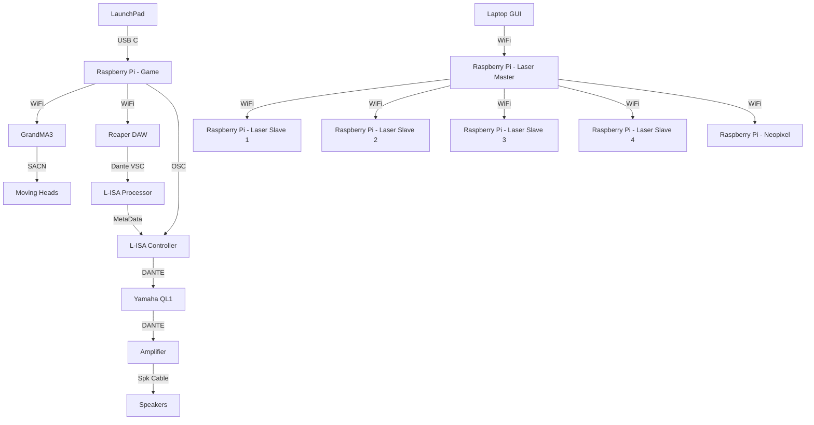
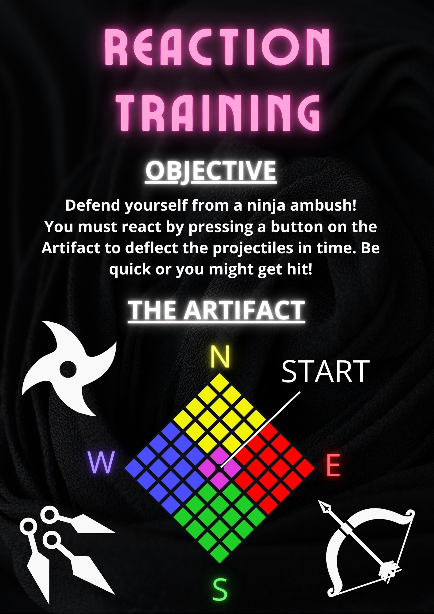

<h1 align="center">
  Final Demonstration
</h1>

  <i align="center">Our final demonstration before the showcase </i>👍

## Overview
This repository contains all the notable assets, codes and others for our Final Demonstration in Week 17 that covers Station 4 - Reaction Training.

In the Final Demonstration, we will be using a Master Station, shared with the other teams. In which in the venue, there are 12 Speakers and the participant will be standing in the middle of the room to play their game.

For the Final Demonstration, the demonstration will feature a full run through of the game. Including 3 stages, a start, a restart and a pass and fail. 

## Hardware & Software Setup

To setup the hardware and software connections, please read through the following:
1. **[Backlog 1 Sprint 1](NYP-EGL314-MSP1/Backlog1%20Sprint1/B1S1.md)** - Base foundation on controlling the GrandMA3
2. **[Backlog 2 Sprint 1](NYP-EGL314-MSP1/Backlog%202%20Sprint1/B2S1.md)** - Configuring L-ISA Studio and Reaper DAW for OSC and MTC control
3. **[Backlog 2 Sprint 2](NYP-EGL314-MSP1/Backlog%202%20Sprint2/B2S2.md)** - Configuring a LaunchPad, sending MIDI commands to Reaper DAW, L-ISA Controller and GrandMA3
4. **[Backlog 3 Sprint 1](NYP-EGL314-MSP1/Backlog3%20Sprint1/B3S1.md)** - Triggering Lasers from a GUI to multiple Raspberry Pis via a Master Pi.

For the Final Demonstration, we will be using a new game code as the game in the past documentations were incomplete. Though despite this, majority of the hierarchy remains the same.

## Assets
Here, are all the varying assets used for the POC. This includes:
1. **[Digital Posters](./Assets/Poster)** - Includes an updated PNG version of the Digital Poster

   
   
2. **[Audio Assets](./Assets/Audio%20Assets)** - Includes a Master Reaper File, a Master L-ISA Controller File and the varying audio assets.
3. **[GrandMA3](./Assets/GrandMA3)** - Includes a Master GrandMA3 file (With lights and IP addresses patched.)

In the final demonstration, there are a few updates to the various files.
1. **Reaper**
   In the Reaper File, there are new audio assets for the various teams and their laser shows. In this case, it would be for Team B.
## Code Files
In this folder, there are multiple python files. We will take a dive into the details of the codes.

Below, there are more detailed explanations of the codes in their respective uses.
