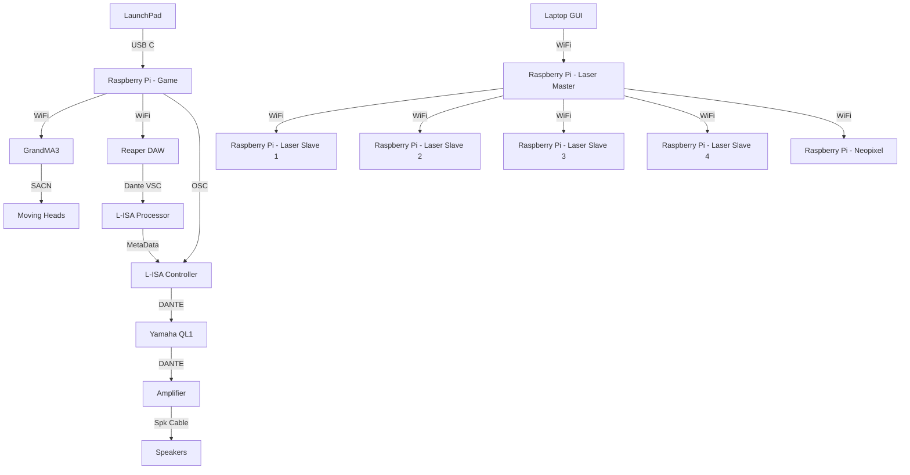

<h1 align="center">
  Minimum Viable Product
</h1>

<p align="center">
  <i align="center">Our reaction training game in all it's glory </i>🤯
</p>

## Overview
This repository contains all the notable assets, codes and others for our Minimum Viable Product (MVP) in Week 14 that covers Station 4 - Reaction Training.

In the Minimum Viable Product, we will be using a Master Station, shared with the other teams. In which in the venue, there are 12 Speakers and the participant will be standing in the middle of the room to play their game.

For the Minimum Viable Product, the demonstration will feature a full run through of the game. Including 3 stages, a start, a restart and a pass and fail. Alongside that, there will also be a GUI to trigger a laser show.

## Hardware & Software Setup

To setup the hardware and software connections, please read through the following:
1. **[Backlog 1 Sprint 1](NYP-EGL314-MSP1/Backlog1%20Sprint1/B1S1.md)** - Base foundation on controlling the GrandMA3
2. **[Backlog 2 Sprint 1](NYP-EGL314-MSP1/Backlog%202%20Sprint1/B2S1.md)** - Configuring L-ISA Studio and Reaper DAW for OSC and MTC control
3. **[Backlog 2 Sprint 2](NYP-EGL314-MSP1/Backlog%202%20Sprint2/B2S2.md)** - Configuring a LaunchPad, sending MIDI commands to Reaper DAW, L-ISA Controller and GrandMA3

## Assets
Here, are all the varying assets used for the POC. This includes:
1. **[Digital Posters](./Assets/Poster)** - Includes a GIF and JPG version of the Digital Poster

   
   
2. **[Audio Assets](./Assets/Audio%20Assets)** - Includes a Master Reaper File, a Master L-ISA Controller File and the varying audio assets.
3. **[GrandMA3](./Assets/GrandMA3)** - Includes a Master GrandMA3 file (With lights and IP addresses patched.)

## Code Files
In this folder, there are 5 python files, in which all are needed to run this one stage for the demonstration.
1. **[gui.py](./Codes/gui.py)** - A GUI to control functions of GrandMA3 and L-ISA Controller.
2. **[osc_client_Grandma3.py](./Codes/osc_client_Grandma3.py)** - A file containing functions for different features that can be controlled and will happen with the lights. These include - Off, Pause and Sequences.
3. **[osc_client_LISA.py](./Codes/osc_client_LISA.py)** - A file containing the controls to trigger varying snaps, for the POC, it will only be for snapshots 1 - 4.
4. **[StartGame.py](./Codes/StartGame.py)** - The main file that is to be ran. In which, pressing the start on the LaunchPad will run the game by calling midi.py
5. **[midi.py](./Codes/midi.py)** - The in-depth game file that includes marker jumping, counter before projectile hits the player and dictates if the stage is passed, if the player failed the stage etc.
6. **[play_stop.py](./Codes/play_stop.py)** - This file has the command to play and stop the Reaper DAW playback.
7. **[reaper_markers.py](./Codes/reaper_markers.py)** - This file has the command to jump to various markers that are already present in the Reaper DAW.

<details><summary><h2>The Specifics</h2></summary>
  
  ### 1. **[gui.py](./Codes/gui.py)**

  <details><summary><b>Show Content</b></summary>
  
  In [gui.py](./Codes/gui.py), there are 2 pages. One for L-ISA Controller and the other for GrandMA3. 
  
  For the L-ISA Controller page, it is calling functions from [osc_client_LISA.py](./Codes/osc_client_LISA.py) where it's firing various snapshots. As said earlier, the snapshots that can be called in [gui.py](./Codes/gui.py) range from snapshots 1-4.

  For the GrandMA3 page, it is calling functions from [osc_client_Grandma3.py](./Codes/osc_client_Grandma3.py) where it's able to execute various sequences to be used and being able to turn off all sequences being carried out.

  </details>
  

  ### 2. **[osc_client_Grandma3.py](./Codes/osc_client_Grandma3.py)**
  
  <details><summary><b>Show Content</b></summary>

  In **[osc_client_Grandma3.py](./Codes/osc_client_Grandma3.py)** you will have to adjust the IP address and Port number to that of your GrandMA3 console. This can be found on line 18 and 19:
     
  #### FOR INFO: IP address and port of the receiving Raspberry Pi

  ```
     PI_A_ADDR = "192.168.254.137"		# ip of GrandMA3 ras pi (When swapping network please check) Line 18
     PORT = 23                        # Line 19
     addr = "/print"
  ```

  Following this, there are multiple functions that include:
  - Executing the various sequences
  - Pausing
  - Oops
  - Everything Off
    
  Which all can be called via the GUI and also called during the gameplay.

  </details>

  ### 3. **[osc_client_LISA.py](./Codes/osc_client_LISA.py)**

  <details><summary><b>Show Content</b></summary>

  In **[osc_client_LISA.py](./Codes/osc_client_LISA.py)**, you will also have to adjust the IP address and ensure that the Port Number is 8880 (L-ISA receives on this port) to that of your device running L-ISA Controller at line 35.

  ```
     # FOR INFO: IP address and port of the receiving Raspberry Pi

     PI_A_ADDR = "192.168.254.30"		# ip of L-ISA controller(When swapping network please check) Line 35

     PORT = 8880
  ```
  Following this, you will be able to fire snapshots from 1 to 4. If you choose to uncomment snapshots 1 to 10, then it will be able to fire snapshots 1 to 10.

  </details>

### 4. **[StartGame.py](./Codes/StartGame.py)**

<details><summary><b>Show Content</b></summary>
  
  In **[StartGame.py](./Codes/StartGame.py)**, you will have to change your device name, which can be found using the instructions [here](https://github.com/huats-club/mts_sensor_cookbook/blob/main/4.%20midi/midi.md) under "To check Midi Controller Name" 

- Line 8

  ```
     LaunchpadPro_Name = "Launchpad Pro MK3:Launchpad Pro MK3 LPProMK3 MIDI 28:0"
  ```
  This code is run so that the participant can start the game when pressing the pad with the msg.note of 67

</details>

### 5. **[midi.py](./Codes/midi.py)**

<details><summary><b>Show Content</b></summary>
  
  In **[midi.py](./Codes/midi.py)**, majority of the code for the game is located here. 

  There are multiple functions that include:
  - Game Over
  - deflect_Success
  - Midi_LaunchPad_MK3; which is the main code that is run through **[StartGame.py](./Codes/StartGame.py)**
  Game over and deflect_Success are called when they are needed, e.g. when the incorrect pad is pressed

</details>
  
### 6. **[play_stop.py](./Codes/play_stop.py)**

<details><summary><b>Show Content</b></summary>
  
  In **[play_stop.py](./Codes/play_stop.py)**, you will also have to adjust the IP address and ensure that the Port Number is 6880 (Repear receives on this port) to that of your device running Reaper

- Line 19 
```
PI_A_ADDR = "192.168.254.30"
```
 The play_stop on line 22 is called by **[StartGame.py](./Codes/StartGame.py)** to start or stop the Reaper track

</details>

### 7. **[reaper_markers.py](./Codes/reaper_markers.py)**

<details><summary><b>Show Content</b></summary>
  
   In **[reaper_markers.py](./Codes/reaper_markers.py)**,you will also have to adjust the IP address and ensure that the Port Number is 6880 (Repear receives on this port) to that of your device running Reaper

- Line 19 
```
PI_A_ADDR = "192.168.254.30"
```
  Multiple functions from lines 28 to 86 are called by  **[gui.py](./Codes/gui.py)** and **[midi.py](./Codes/midi.py)** to jump to certain markers on the Reaper track
</details>
