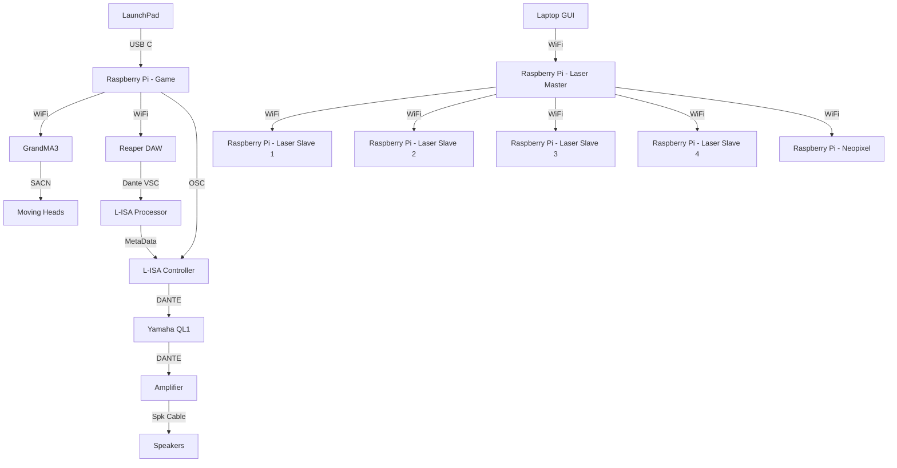
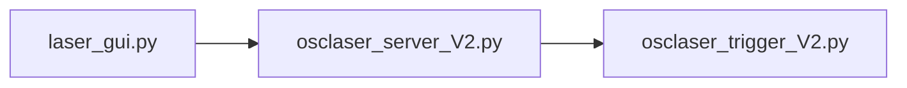
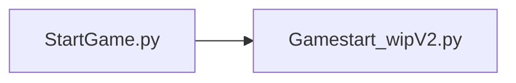

<h1 align="center">
  Minimum Viable Product
</h1>

<p align="center">
  <i align="center">Our reaction training game in all it's glory </i>🤯
</p>

## Overview
This repository contains all the notable assets, codes and others for our Minimum Viable Product (MVP) in Week 14 that covers Station 4 - Reaction Training.

In the Minimum Viable Product, we will be using a Master Station, shared with the other teams. In which in the venue, there are 12 Speakers and the participant will be standing in the middle of the room to play their game.

For the Minimum Viable Product, the demonstration will feature a full run through of the game. Including 3 stages, a start, a restart and a pass and fail. Alongside that, there will also be a GUI to trigger a laser show.

## Hardware & Software Setup

To setup the hardware and software connections, please read through the following:
1. **[Backlog 1 Sprint 1](NYP-EGL314-MSP1/Backlog1%20Sprint1/B1S1.md)** - Base foundation on controlling the GrandMA3
2. **[Backlog 2 Sprint 1](NYP-EGL314-MSP1/Backlog%202%20Sprint1/B2S1.md)** - Configuring L-ISA Studio and Reaper DAW for OSC and MTC control
3. **[Backlog 2 Sprint 2](NYP-EGL314-MSP1/Backlog%202%20Sprint2/B2S2.md)** - Configuring a LaunchPad, sending MIDI commands to Reaper DAW, L-ISA Controller and GrandMA3
4. **[Backlog 3 Sprint 1](NYP-EGL314-MSP1/Backlog3%20Sprint1/B3S1.md)** - Triggering Lasers from a GUI to multiple Raspberry Pis via a Master Pi.
5. **[Backlog 3 Sprint 2](NYP-EGL314-MSP1/Backlog3%20Sprint2/B3S2.md)** - Creating the full length of the game.

## Assets
Here, are all the varying assets used for the POC. This includes:
1. **[Digital Posters](./Assets/Poster)** - Includes an updated PNG version of the Digital Poster

   
   
2. **[Audio Assets](./Assets/Audio%20Assets)** - Includes a Master Reaper File, a Master L-ISA Controller File and the varying audio assets.
3. **[GrandMA3](./Assets/GrandMA3)** - Includes a Master GrandMA3 file (With lights and IP addresses patched.)

## Code Files
In this folder, there are multiple python files. We will take a dive into the details of the codes.

Below, there are more detailed explanations of the codes in their respective uses.
<details><summary><h2>Laser Show</h2></summary>

In the laser show, it mainly revolves around [laser_gui.py](./Laser_Gui.py), [osclaser_server_V2.py](./osclaser_server_V2.py) and [osclaser_trigger_V2.py](./osclaser_trigger_V2.py).

For the laser show, this is how the code hierarchy would look like:

<details><summary><h3>laser_gui.py</h3></summary>
  
In laser_gui.py, there are a few things to note. Firstly, are the imports. Importing in the pythonosc library to be able to communicate with the Master Raspberry Pi and the Slave Raspberry Pi after. Also importing the [reaper_markers.py](./reaper_markers.py) code. These are all seen from lines 1 to 7.
  
```
from pythonosc import osc_server, dispatcher

from pythonosc import udp_client

import tkinter as tk

import reaper_markers

# import RPi.GPIO as GPIO

import time
```
With that, there is a need to set a send_addr, send_port and addr to be able to send a message to the Master Raspberry Pi, this can be seen from lines 131 to 133 where in this example, the send_addr is listed as `192.168.254.49`, then send_port listed as `2000` and the addr listed as `/print` which are the respective IP address and port of the Master Raspberry Pi
```
send_addr = "192.168.254.49"
send_port = 2000
addr = "/print"
```

Slightly late down in the code, there is another IP address and port used to send commands to a Neopixel LED Strip as well. This was set to `192.168.254.242` and the port is listed as `2005` following the functions above. This can be seen from lines 185 to 194.
```
def send_color(receiver_ip, receiver_port, r, g, b):  # Sends colour commands to the Neopixel
    client = udp_client.SimpleUDPClient(receiver_ip, receiver_port) 
    client.send_message("/color", [r, g, b])

def send_brightness(receiver_ip, receiver_port, brightness): # Sends brightness commands to the Neopixel
    client = udp_client.SimpleUDPClient(receiver_ip, receiver_port)
    client.send_message("/brightness", [brightness])

PI_B_ADDR = "192.168.254.242"  # Change to your RPi's IP address
PORT2 = 2005
```

After this, are the functions for the lasers. In here, we will just take a random function as an example since majority of them are similar.
```
def AllOffOneByOne():
    msg = ["1,1,0", "1,2,0", "2,1,0", "2,2,0", "3,1,0", "3,2,0",
           "4,1,0", "4,2,0", "5,1,0", "5,2,0", "6,1,0", "6,2,0",
           "7,1,0", "7,2,0", "8,1,0", "8,2,0", "9,1,0", "9,2,0",
           "10,1,0", "10,2,0", "11,1,0", "11,2,0", "12,1,0", "12,2,0"] # The messages to be sent to the Master Pi
    
    y = int(0) # Creating a variable called y.
    while y < len(msg): # A while loop that stays true for as long as y is not longer than the array called msg.
        time.sleep(0.03) # Can be removed based on whether you want a delay in between actions. e.g From first message to second message
        send_message(send_addr, send_port, addr, msg[y]) # To send command to Master Raspberry Pi
        print(msg[y]) 
        y += 1 # To increase the variable called y.

        if y == len(msg): # An if statement, when y is equals to the length of the array, it will stop the while loop.
            break 
```
Functions like these are then integrated into one big function for the laser show which can be seen here, along with explanations of what different lines do.
```
def lasersequence():
    try:
        Laser_SequenceRP() # A function that calls for Reaper to start playing the music.
    except Exception as e:
        print(f"Error in Laser_SequenceRP: {e}")
        return

    print("test")

    beat_gap = 60 / 101  # Time interval between beats 
    count = 0 # Start a variable count
    start_time = time.time() # Set start_time as the present time that the code was ran.

    try:
        while time.time() - start_time < 30: # For as long as when the current time minus starting time duration is lesser than 30, the loop will continue
            time.sleep(beat_gap) # To set the interval between actions as the gap between beats

            if count % 2 == 0: # Does it every even number.
                send_color(PI_B_ADDR, PORT2, 0, 0, 0) # Set no colour to Neopixels
                send_brightness(PI_B_ADDR, PORT2, 0) # Set no brightness to Neopixels
            else:
                send_color(PI_B_ADDR, PORT2, 255, 0, 0)
                send_brightness(PI_B_ADDR, PORT2, 0.3)

            # Using a dictionary to map counts to functions
            actions = {
                0: AllOff,
                1: AllOn,
                2: OddSpk,
                3: AllOff,
                4: AllOnOneByOne,
                5: AllOffOneByOne,
                6: crossfire,
                7: crossfireOpp,
                8: AllOff,
                9: AllOn,
                10: AllOffOneByOne,
                11: OneToThreeOn,
                12: FourToSixOn,
                13: SevenToNineOn,
                14: TenToTwelveOn,
                15: AllOff,
                16: OddSpk,
                17: EvenSpk,
                18: AllOff,
                19: OneToThreeOn,
                20: AllOff,
                21: AllOn,
                22: AllOff,
                23: OddSpk,
                24: EvenSpk,
                25: AllOnOneByOne,
                26: crossfire,
                27: crossfireOpp,
                28: TopHalf,
                29: BottomHalf,
                30: AllOffOneByOne,
                31: LeftHalf,
                32: RightHalf,
                33: AllOffOneByOne,
                34: AllOn,
                35: AllOff,
                36: OneToThreeOnOneByOne,
                37: SevenToNineOnOneByOne,
                38: AllOffOneByOne,
                39: AllOnOneByOne,
                40: AllOnOneByOne,
            }

            if count in actions: # Checking if the count still exists in the actions
                try:
                    actions[count]() # If the count has a definition in the dictionary, it will retrieve and call that function
                except Exception as e:
                    print(f"Error executing action for count {count}: {e}")

            print(count)
            count += 1 # Will increase the count each after delaying for each beat gap.

    except Exception as e:
        print(f"Error in main loop: {e}")

    try:
        AllOff()
        send_color(PI_B_ADDR, PORT2, 0, 0, 0)
        send_brightness(PI_B_ADDR, PORT2, 0)
        reaper_markers.play_stop()
        print(f"Counted {count} beats in 30 seconds.")  # max Count = 73/72
    except Exception as e:
        print(f"Error during cleanup: {e}")
```

</details>

<details><summary><h3>osclaser_server_V2.py</h3></summary>

In osclaser_server_V2.py, it is a code to be put into the Master Raspberry Pi to carry out 2 functions. One, receiving the commands from the Laser_Gui. Two, to send the received commands to the Slave Raspberry Pi which holds [osclaser_trigger_V2.py](./osclaser_trigger_V2.py). First, the receiver_ip and receiver_port is to be set to the respective values of the Master Raspberry Pi which in this example is `192.168.254.49` and `2003`. This was set on lines 10 and 11 of the code as seen below:
```
receiver_ip = "192.168.254.49" # Team A
receiver_port = 2003
```
Following this, is the function to enable the Master Raspberry Pi to receive the commands and re-send them out to the Slave Raspberry Pi. There will be explanation next to the respective codes to talk about their functions seen from lines 13 to 35.
```
# this function prints the arguments in received OSC messages
def print_args(addr, *args):
  if addr == "/print": # An If statement to detect for the messages with the address /print
    print(f"message received {args[0]}")
    msg = args[0] 
    var = args[0].split(',')
    spk = int(var[0].strip()) 
    addr = "/trigger" # Sets a new address before sending out the message to slave raspberry pi

    if 1 <= spk <= 3:
       send_addr = "192.168.254.197" #Team C (Updates the send_addr and send_port to the respective Slave Raspberry Pis)
       send_port = 2001
    elif 4 <= spk <= 6:
      send_addr = "192.168.254.101" #Team E
      send_port = 2002
    elif 7 <= spk <= 9:
      send_addr = "192.168.254.72" #Team B
      send_port = 2003
    elif 10 <= spk <= 12:
      send_addr = "192.168.254.236" #Team F
      send_port = 2004
    
    osc_client.send_message(send_addr, send_port, addr, msg)
```
</details>

<details><summary><h3>osclaser_trigger_V2.py</h3></summary>

In osclaser_trigger_V2.py, it is a code to be put into the Slave Raspberry Pis, this code will receive the commands from the Master Raspberry Pi and followed by using RPi.GPIO to trigger the different relay channels that will then turn on and off the lasers respectively. Since there is going to be a use of the RPi.GPIO pins, there will be a need to setup these GPIO pins as shown below and can be found from Lines 10 to 23:
```
# GPIO pin setup
r1_c1 = 21
r1_c2 = 20
r2_c1 = 26
r2_c2 = 19
r3_c1 = 3
r3_c2 = 2

GPIO.setmode(GPIO.BCM)
GPIO.setup(r1_c1, GPIO.OUT, initial=GPIO.HIGH) # Default on HIGH since the Relay is set on Normally Open.
GPIO.setup(r1_c2, GPIO.OUT, initial=GPIO.HIGH)
GPIO.setup(r2_c1, GPIO.OUT, initial=GPIO.HIGH)
GPIO.setup(r2_c2, GPIO.OUT, initial=GPIO.HIGH)
GPIO.setup(r3_c1, GPIO.OUT, initial=GPIO.HIGH)
GPIO.setup(r3_c2, GPIO.OUT, initial=GPIO.HIGH)
```
Following that, since it is receiving commands from the Master Raspberry Pi via OSC, there is a need to set a receiving_ip and receiving_port. In this example we will be using Team B's addresses set to `192.168.254.72` and `2003` respectively. This can be set at lines 26 and 27.
```
# Change the receiver_ip value to your RPi's IP address
receiver_ip = "192.168.254.72" # IP address of your Pi
receiver_port = 2003 # Team C: 2001, Team E: 2002, Team B: 2003, Team F: 2004
```
After this, would be the function to control the relays. Details and explanations of the code will appear as comments below:
```
# This function handles the received OSC messages and controls the GPIO pins
def control_relay(addr, *args):
    if addr == "/trigger": # Detects for messages with the address "/trigger"
        msg = args[0].split(',') # Splits the message received from the Master Raspberry Pi
        spk = int(msg[0].strip())
        channel = int(msg[1].strip()) # Will assign the value based on the split from the msg (e.g spk, channel, value) 
        value = int(msg[2].strip())  # First value of msg array will be speaker number,
                                      # second will be the relay channel and last will be the value to turn it on or Off
        print(f"The spk {spk} controlling channel {channel} and the value is {value}")
        if spk == 7: # Change according to spk number (refer to S536 drawing)
            if channel == 1:
                if value == 1:
                    GPIO.output(r1_c1, GPIO.LOW)
                    print("Relay 1 channel 1 turned ON")
                elif value == 0:
                    GPIO.output(r1_c1, GPIO.HIGH)
                    print("Relay 1 channel 1 turned OFF")
            elif channel == 2:
                if value == 1:
                    GPIO.output(r1_c2, GPIO.LOW)
                    print("Relay 1 channel 2 turned ON")
                elif value == 0:
                    GPIO.output(r1_c2, GPIO.HIGH)
                    print("Relay 1 channel 2 turned OFF")

        elif spk == 8: # Change according to spk number (refer to S536 drawing)
            if channel == 1:
                if value == 1:
                    GPIO.output(r2_c1, GPIO.LOW)
                    print("Relay 2 channel 1 turned ON")
                elif value == 0:
                    GPIO.output(r2_c1, GPIO.HIGH)
                    print("Relay 2 channel 1 turned OFF")
            elif channel == 2:
                if value == 1:
                    GPIO.output(r2_c2, GPIO.LOW)
                    print("Relay 2 channel 2 turned ON")
                elif value == 0:
                    GPIO.output(r2_c2, GPIO.HIGH)
                    print("Relay 2 channel 2 turned OFF")

        elif spk == 9: # Change according to spk number (refer to S536 drawing)
            if channel == 1:
                if value == 1:
                    GPIO.output(r3_c1, GPIO.LOW)
                    print("Relay 3 channel 1 turned ON")
                elif value == 0:
                    GPIO.output(r3_c1, GPIO.HIGH)
                    print("Relay 3 channel 1 turned OFF")
            elif channel == 2:
                if value == 1:
                    GPIO.output(r3_c2, GPIO.LOW)
                    print("Relay 3 channel 2 turned ON")
                elif value == 0:
                    GPIO.output(r3_c2, GPIO.HIGH)
                    print("Relay 3 channel 2 turned OFF")
```
</details>

</details>
<details><summary><h2>Reaction Time Game</summary>

In the reaction time game , it mainly revolves around [StartGame.py](./StartGame.py) and [Gamestart_wipV2.py](./Gamestart_wipV2.py)

For the reactiom time game , this is how the code hierarchy would look like:



<details><summary><h3>StartGame.py</h3></summary>

In StartGame.py, the first thing to note are the imports, from lines 1 to 8, [reaper_markers](./reaper_markers.py), [Lisa_GrandMa3_Functions](./Lisa_GrandMa3_Functions.py) and [Gamestart_wipV2](./Gamestart_wipV2.py)

```
#Imports
import mido 
import reaper_markers
import sys
import Lisa_GrandMa3_Functions
import Gamestart_wipV2
from pythonosc import osc_server, dispatcher
import time
```
Right after the imports, is the main function of this file, the most important part of the code is from lines 25 to 35

```
if msg.note == 67: #start
    print ('Game Start')
    
    reaper_markers.play_stop() # Stop any currently playing track 
    
    Lisa_GrandMa3_Functions.clear_all()   
    Lisa_GrandMa3_Functions.clear_all()
    Lisa_GrandMa3_Functions.playing()
    Lisa_GrandMa3_Functions.playing()
    reaper_markers.startMk()
    Gamestart_wipV2.launchpad_listen()
```
The code simply requires input from launchpad, specifically in this case msg.note == 67 to trigger this if statement, sending messages to GrandMa3, Reaper and the function in [Gamestart_wipV2,py](./Gamestart_wipV2.py), launchpad_listen() to start the game function.


</details>

<details><summary><h3>Gamestart_wipV2.py</h3></summary>

In Gamestart_wipV2.py, it begins with the imports, play_stop, reaper_markers and Lisa_GrandMa3_Functions are to utilize the functions within each file to send messages to Reaper, L-isa and GrandMa3. These can be seen from line  1 to 11

```
#Imports
import mido 
import play_stop
import reaper_markers
import sys
import Lisa_GrandMa3_Functions
from pythonosc import osc_server, dispatcher
import time
import random
import threading
import definitions
```
Right after, lines 13 to 62 are functions for our main game function launch_listen
```
def North():
    global tracker1
    countToSG2(tracker1)
    if tracker1 == 4:
        definitions.nextstage()
        countT_stop(count_timing)
    else:
        definitions.North()
    
def South():
    global tracker1
    countToSG2(tracker1)
    if tracker1 == 4:
        definitions.nextstage()
    else:
        definitions.South()

def East():
    global tracker1
    countToSG2(tracker1)
    if tracker1 == 4:
        definitions.nextstage()
    else:
        definitions.East()

def West():
    countToSG2(tracker1)
    if tracker1 == 4:
        definitions.nextstage()
    else:
        definitions.West()

def countT_start(count_timing):
    print('count_timing start')
    count = 0
    count += 0.5
    print(count)
    return count

def countT_stop(count_timing):
    print('count_timing Stopped')
    count = 0
    print(count)
    return count

def countToSG2(tracker1):
    count = 0
    count += 1
    return count
```

launchpad_listen  starts from line  63 to 166

```
def launchpad_listen():
    LaunchpadPro_Name = "Launchpad Pro MK3:Launchpad Pro MK3 LPProMK3 MIDI 28:0"
    if LaunchpadPro_Name not in mido.get_input_names():
        print(f"Device {LaunchpadPro_Name} not found. Please check the device name")
        return
    with mido.open_input(LaunchpadPro_Name) as inport,mido.open_output(LaunchpadPro_Name) as outport:
        print(f"Listening to {LaunchpadPro_Name} for note messages" )
        global count_timing
        count_game = 0
        NorthPressed = 'False'
        SouthPressed = 'False'
        EastPressed = 'False'
        WestPressed = 'False'
        
        game_fail = 'False'
        directional_Var = 0
        tracker1 = 0
        count_timing = 0
        try:
            while True:
                #for msg in inport:
                time.sleep(0.5)                            
                count_game += 0.5
                print(f"The game has been going for {count_game} seconds")
                for msg in inport.iter_pending():
                    if msg.type == 'note_on':
                        print(f"Note On:Note={msg.note}")
                        if count_game == 37: #28 is when tutorial ends
                            Lisa_GrandMa3_Functions.Seq21()
                            #################Projectile 1 (Hardcoded)################
                        elif 40 >= count_game >= 38: #Count for first projectile
                            count_game2 = 0  
                            
                            
                            time.sleep(0.5)            
                            count_timing += 0.5
                            print(f"How many seconds has it been since the projectile has been fired {count_timing}")
                            if count_timing <= 3: #if they react under 4 sec
                                if msg.note == 60 and NorthPressed == 'False': #actual snapshot coresponding to north
                                    countToSG2(tracker1)
                                    print(f"How many projectiles have been fired:{tracker1}")
                                    if tracker1 == 4:
                                        definitions.nextstage()
                                    else:
                                        NorthPressed = 'True'
                                        print(NorthPressed)
                                        print("North deflected")
                                        countT_stop(count_timing)
                                        definitions.North()
                                        break
                                elif msg.note != 60 and NorthPressed == 'False':
                                    definitions.game_over()
                                    #trigger for restart
                                    game_fail = 'True'
                                    exit()
                                         
                                           
                                elif count_timing > 4 and NorthPressed == 'False':
                                    definitions.game_over()
                                    #trigger for restart
                                    game_fail = 'True'
                                    exit() 
                                    
                                    
                        elif 40 >= count_game >= 38  and NorthPressed == 'True':
                            pass
                        
                        elif count_game == 41:
                            definitions.resetVar()
                            Lisa_GrandMa3_Functions.Seq24()
                        elif count_game >= 40: #Second Projectiles
                            if msg.note == 65:
                                definitions.deflect_success()
                                definitions.nextstage()
                                time.sleep(5)
                                exit()
                            exit()
                            countT_start(count_timing)
                            if count_timing <= 3:
                                if msg.note == 60 and directional_Var == 'North':
                                    North()
                                elif msg.note == 65 and directional_Var == 'South':
                                    South()
                                elif msg.note == 62 and directional_Var == 'East':
                                    East()
                                elif msg.note == 64 and directional_Var == 'West':
                                    West()
                            elif count_timing > 4 and (NorthPressed and SouthPressed and EastPressed and WestPressed) == 'False' :
                                        definitions.game_over()
                                        #trigger for restart
                                        game_fail = 'True'
                                        exit()
                                         
                                
                        elif 47 >= count_game >= 44 and SouthPressed == 'True':
                            pass
                        elif count_game == 48:
                            definitions.resetVar()
                        
                                
                    else:
                        print(f'Note Off: Note={msg.note}')
        except KeyboardInterrupt:
            print("stopped listening to MIDI messages.")
```

Breaking the function down into parts, with lines 64 to 69,

```
LaunchpadPro_Name = "Launchpad Pro MK3:Launchpad Pro MK3 LPProMK3 MIDI 28:0"
    if LaunchpadPro_Name not in mido.get_input_names():
        print(f"Device {LaunchpadPro_Name} not found. Please check the device name")
        return
    with mido.open_input(LaunchpadPro_Name) as inport,mido.open_output(LaunchpadPro_Name) as outport:
        print(f"Listening to {LaunchpadPro_Name} for note messages" )
```

This code is what we use to listen to our device, in this case the `"Launchpad Pro MK3:Launchpad Pro MK3 LPProMK3 MIDI 28:0"`, which will change based on what device you are using. If no device is connected, it will print out a message saying so, otherwise it will begin listening to messages from the device.

From lines 89 to 124,
```
if msg.type == 'note_on':
                        print(f"Note On:Note={msg.note}")
                        if count_game == 37: #28 is when tutorial ends
                            Lisa_GrandMa3_Functions.Seq21()
                            #################Projectile 1 (Hardcoded)################
                        elif 40 >= count_game >= 38: #Count for first projectile
                            count_game2 = 0  
                            
                            
                            time.sleep(0.5)            
                            count_timing += 0.5
                            print(f"How many seconds has it been since the projectile has been fired {count_timing}")
                            if count_timing <= 3: #if they react under 4 sec
                                if msg.note == 60 and NorthPressed == 'False': #actual snapshot coresponding to north
                                    countToSG2(tracker1)
                                    print(f"How many projectiles have been fired:{tracker1}")
                                    if tracker1 == 4:
                                        definitions.nextstage()
                                    else:
                                        NorthPressed = 'True'
                                        print(NorthPressed)
                                        print("North deflected")
                                        countT_stop(count_timing)
                                        definitions.North()
                                        break
                                elif msg.note != 60 and NorthPressed == 'False':
                                    definitions.game_over()
                                    #trigger for restart
                                    game_fail = 'True'
                                    exit()
                                         
                                           
                                elif count_timing > 4 and NorthPressed == 'False':
                                    definitions.game_over()
                                    #trigger for restart
                                    game_fail = 'True'
                                    exit() 
```
It encompasses the core functionality of the other sections in this functions. When a projectile is fired out from the speaker, a count begins to track if the player reacts in time. 
Afterwards it moves on to check if the player presses the right button in under 3 seconds, which if true they deflect the projectile, stoping the count for their reaction speed and jumping to a random projectile marker and this repeats until they either fail to react in time, press the wrong note, or they pass to the next stage

</details>

</details>
