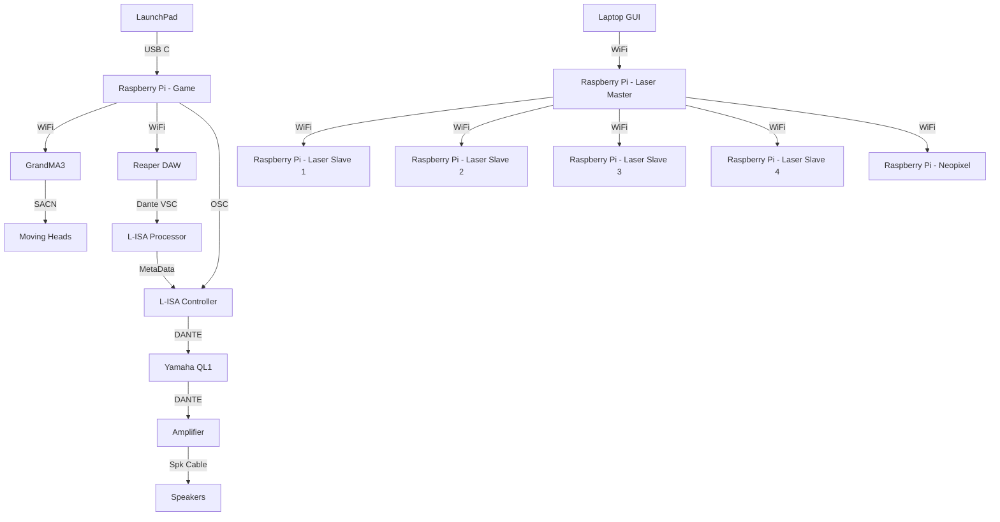
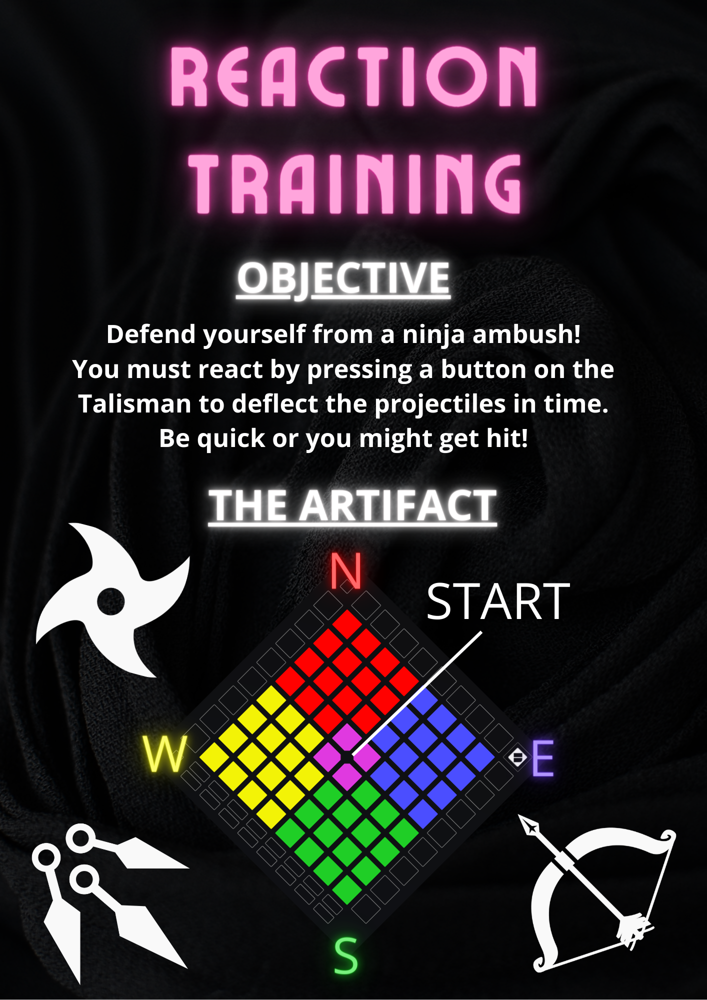

<h1 align="center">
  Minimum Viable Product
</h1>

  <i align="center">Our reaction training game in all it's glory </i>🤯

## Overview
This repository contains all the notable assets, codes and others for our Minimum Viable Product (MVP) in Week 14 that covers Station 4 - Reaction Training.

In the Minimum Viable Product, we will be using a Master Station, shared with the other teams. In which in the venue, there are 12 Speakers and the participant will be standing in the middle of the room to play their game.

For the Minimum Viable Product, the demonstration will feature a full run through of the game. Including 3 stages, a start, a restart and a pass and fail. Alongside that, there will also be a GUI to trigger a laser show.

## Hardware & Software Setup

To setup the hardware and software connections, please read through the following:
1. **[Backlog 1 Sprint 1](NYP-EGL314-MSP1/Backlog1%20Sprint1/B1S1.md)** - Base foundation on controlling the GrandMA3
2. **[Backlog 2 Sprint 1](NYP-EGL314-MSP1/Backlog%202%20Sprint1/B2S1.md)** - Configuring L-ISA Studio and Reaper DAW for OSC and MTC control
3. **[Backlog 2 Sprint 2](NYP-EGL314-MSP1/Backlog%202%20Sprint2/B2S2.md)** - Configuring a LaunchPad, sending MIDI commands to Reaper DAW, L-ISA Controller and GrandMA3
4. **[Backlog 3 Sprint 1](NYP-EGL314-MSP1/Backlog3%20Sprint1/B3S1.md)** - Triggering Lasers from a GUI to multiple Raspberry Pis via a Master Pi.
5. **[Backlog 3 Sprint 2](NYP-EGL314-MSP1/Backlog3%20Sprint2/B3S2.md)** - Creating the full length of the game.

## Assets
Here, are all the varying assets used for the POC. This includes:
1. **[Digital Posters](./Assets/Poster)** - Includes an updated PNG version of the Digital Poster

   
   
2. **[Audio Assets](./Assets/Audio%20Assets)** - Includes a Master Reaper File, a Master L-ISA Controller File and the varying audio assets.
3. **[GrandMA3](./Assets/GrandMA3)** - Includes a Master GrandMA3 file (With lights and IP addresses patched.)

## Code Files
In this folder, there are 5 python files, in which all are needed to run this one stage for the demonstration.
1. **[gui.py](./Codes/gui.py)** - A GUI to control functions of GrandMA3 and L-ISA Controller.
2. **[osc_client_Grandma3.py](./Codes/osc_client_Grandma3.py)** - A file containing functions for different features that can be controlled and will happen with the lights. These include - Off, Pause and Sequences.
3. **[osc_client_LISA.py](./Codes/osc_client_LISA.py)** - A file containing the controls to trigger varying snaps, for the POC, it will only be for snapshots 1 - 4.
4. **[StartGame.py](./Codes/StartGame.py)** - The main file that is to be ran. In which, pressing the start on the LaunchPad will run the game by calling midi.py
5. **[midi.py](./Codes/midi.py)** - The in-depth game file that includes marker jumping, counter before projectile hits the player and dictates if the stage is passed, if the player failed the stage etc.
6. **[play_stop.py](./Codes/play_stop.py)** - This file has the command to play and stop the Reaper DAW playback.
7. **[reaper_markers.py](./Codes/reaper_markers.py)** - This file has the command to jump to various markers that are already present in the Reaper DAW.

<h2>Laser Show</h2>

<h2>Reaction Time Game

