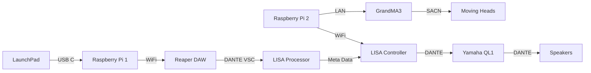

<h1 align="center">
  Proof Of Concept
</h1>

  <i align="center">All the resources required to show a Proof Of Concept </i>😨

## Overview
This repository contains all the notable assets, codes and others for our Proof Of Concept in Week 8 that covers Station 4 - Reaction Training.

In the Proof Of Concept, we will be using a Master Station, shared with the other teams. In which in the venue, there are 12 Speakers and the participant will be standing in the middle of the room to play their game.

For the Proof Of Concept, the demonstration will only last a stage long (e.g. The Tutorial Stage) to make it swift, short and simple.

## Hardware & Software Setup

## Assets
Here, are all the varying assets used for the POC. This includes:
1. **[Digital Posters](./Assets/Poster)** - Includes a GIF and JPG version of the Digital Poster
